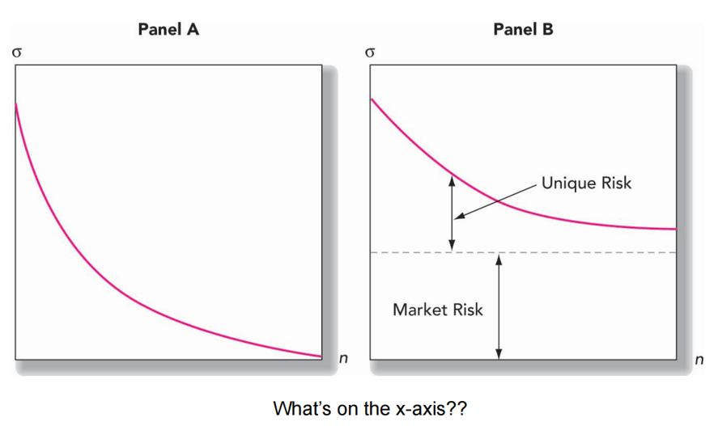
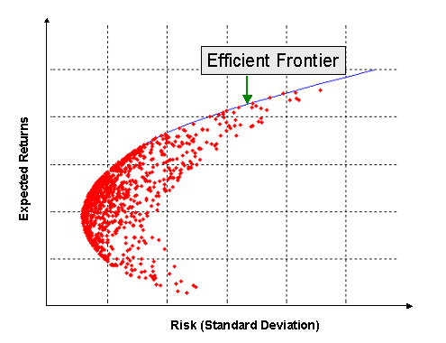
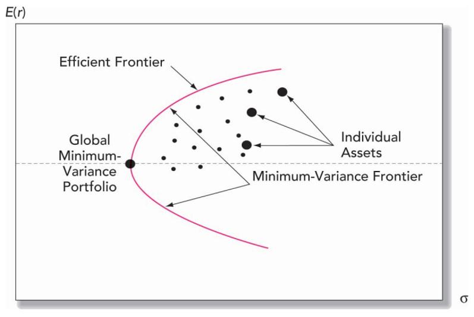

# Diversification {#ch3}

### Portfolio Construction

Portfolio construction generally has three steps: 

1. **Capital allocation** between the risky portfolio and risk-free assets
2. **Asset allocation** across wide asset classes (stocks, international stocks, long-term bonds). 
3. **Security selection**. 

## Major Risks of Stock Portfolio

| Risk Type        | Description                                     |
|------------------|-------------------------------------------------|
| **Market Risk**  | Fluctuations in overall market affecting portfolio value. |
| Sector Risk      | Specific sectors or industries under-performing. |
| **Company Risk** | Individual companies facing financial difficulties or poor performance. |
| Liquidity Risk   | Difficulty in buying or selling assets without significant price changes. |
| Currency Risk    | Exchange rate fluctuations impacting international investments. |
| Interest Rate Risk | Changes in interest rates affecting bond prices and portfolio value. |
| Political Risk   | Political events or policy changes impacting financial markets. |
| Regulatory Risk  | Changes in regulations affecting industries or companies in the portfolio. |

- Market risk (**systematic risk**): non-diversifiable risk
- Unique risk (**non-systematic risk**): firm-specific risk, diversifiable risk



## Portfolio Calculations

### Expected return

The **expected return** of the portfolio is

$$ E(r_P) = w_1 E(r_1) + w_2 E(r_2) $$

Where:

- $E(r_P)$is the expected return of the portfolio.
- $w_1$ is the weight of asset 1 in the portfolio.
- $E(r_1)$ is the expected return of asset 1.
- $w_2$ is the weight of asset 2 in the portfolio.
- $E(r_2)$ is the expected return of asset 2.

### variance

**Variance** measures how much the values of a random variable vary or spread out from the mean (average)

The **variance** of the portfolio $\sigma_P^2$ can be calculated using the following formula:

$$ \sigma_P^2 = w_1^2 \sigma_1^2 + w_2^2 \sigma_2^2 + 2w_1 w_2 \rho_{12} \sigma_1 \sigma_2 $$

Where:

- $\sigma_P^2$ is the variance of the portfolio.
- $w_1$ is the weight of asset 1 in the portfolio.
- $\sigma_1^2$ is the variance of returns of asset 1.
- $w_2 $ is the weight of asset 2 in the portfolio.
- $\sigma_2^2$ is the variance of returns of asset 2.
- $\rho_{12}$ is the correlation coefficient between returns of assets 1 and 2.
- $\sigma_1$ and $\sigma_2$ are the standard deviations of returns of assets 1 and 2, respectively.

The variance formula accounts for the individual variances of assets 1 and 2, as well as their **covariance**.

```{r}
# Define weights, variances, and correlation as vectors
weights <- c(0.6, 0.4)
variances <- c(0.15^2, 0.12^2)
correlation <- 0.5

# Calculate the portfolio variance
portfolio_variance <- sum(weights^2 * variances) + 2 * weights[1] * weights[2] * correlation * sqrt(variances[1]) * sqrt(variances[2])
portfolio_variance

```


$$Cov(r_1,r_2 )=\rho_{12} 𝜎_1 𝜎_2$$

#### Case I: $ \rho = 1 $
When the correlation coefficient is 1, the formula simplifies to:

$$
\begin{aligned}
\sigma_P^2 &= (w_1 \sigma_1 + w_2 \sigma_2)^2 \\
\sigma_P  &= w_1 \sigma_1 + w_2 \sigma_2 \\
\end{aligned}
$$

#### Case II: $ \rho = -1 $
When the correlation coefficient is -1, the formula simplifies to:

$$
\begin{aligned}
\sigma_P^2 &= (w_1 \sigma_1 - w_2 \sigma_2)^2 \\
\sigma_P  &= w_1 \sigma_1 - w_2 \sigma_2 \\
\end{aligned}
$$

### Covariance

The **covariance** between returns of assets A and B (\(Cov(r_A, r_B)\)) can be calculated using the following formula:

$$Cov(r_A, r_B) = \sum_{i=1}^{n} p(i)[r_A(i) - E(r_A)][r_B(i) - E(r_B)]$$

Where:

- $Cov(r_A, r_B)$ is the covariance between returns of assets A and B.
- $p(i)$ is the probability of scenario $i$.
- $r_A(i)$ and $r_B(i)$ are the returns of assets A and B, respectively, in scenario $i$.
- $E(r_A)$ and $E(r_B)$ are the expected returns of assets A and B, respectively.

**R code**

```{r}
returns_A <- c(0.05, 0.03, 0.02, 0.06, 0.04)  # Returns for asset A
returns_B <- c(0.04, 0.02, 0.01, 0.05, 0.03)  # Returns for asset B

# Expected returns of assets A and B
E_r_A <- mean(returns_A)
E_r_B <- mean(returns_B)

# Probabilities of scenarios
probabilities <- c(0.2, 0.15, 0.25, 0.1, 0.3)

# Calculation of covariance
covariance <- sum(probabilities * (returns_A - E_r_A) * (returns_B - E_r_B))

# Print the covariance
print(paste("Covariance between returns of assets A and B:", covariance))

```
### Correlation 

$${\rho_12} = \frac{Cov(r_1,r_2 )}{\sigma_1 \sigma_2}$$

- The portfolio return is not affected by correlation between returns 

- Thus, investors should always prefer to add to their portfolios assets with low or negative correlation to diversify risks.

The lower the correlation, the greater the potential benefit from diversification.

### Variance calculations

If we have perfectly negatively correlated assets in our portfolios, then the portfolio standard deviation can be reduced to zero by choosing appropriate weights.


Given:

- $w_1$ = $0.40$
- $\sigma_1^2$ = $0.014$
- $w_2$ = $0.60$
- $\sigma_2^2$ = $0.04$
- $Cov(r_1, r_2)$ = $0.0072$

Calculate:
$$
\begin{aligned}
\rho        &= \frac{Cov(r_1, r_2)}{\sigma_1 \times \sigma_2} \\ 
            &= \frac{0.007}{\sqrt{0.014} \times \sqrt{0.04}} \\ 
            &= 0.3 \\
\end{aligned}
$$            
$$
\begin{aligned}           
            
 \sigma_P^2 &= w_1^2 \sigma_1^2 + w_2^2 \sigma_2^2 + 2w_1 w_2 \rho(r_1, r_2) \sigma_1 \sigma_2 \\
            &= 0.40^2 (0.014) + 0.60^2 (0.04) + 2(0.40)(0.60)[0.3\sqrt{0.014} \times \sqrt{0.04}] \\
            &= 0.02 \\
\sigma_P    &= \sqrt{0.02} = 0.142 \\
\end{aligned}
$$            
$$
\begin{aligned} 

\text{Weighted}(\sigma) &= 0.40\sqrt{0.014} + 0.60\sqrt{0.04} \\
            &= 0.168 \\
            
\end{aligned}
$$

$$
\begin{aligned} 
\text{Diversification Benefit}
            &= 0.168 - 0.142 \\
            &= 0.026 
\end{aligned}
$$
```{r}
# Given values
w1 <- 0.9
w2 <- 0.1
sigma1_squared <- 0.0237^2
sigma2_squared <- 0.0295^2
covariance <- 0.40

# Calculate correlation coefficient
rho <- covariance / sqrt(sigma1_squared * sigma2_squared)
rho 

# Calculate portfolio variance
portfolio_variance <- w1^2 * sigma1_squared + w2^2 * sigma2_squared + 2 * w1 * w2 * covariance
portfolio_variance

# Calculate portfolio standard deviation
portfolio_sd <- sqrt(portfolio_variance)
portfolio_sd

# Calculate weighted standard deviation
weighted_sd <- w1 * sqrt(sigma1_squared) + w2 * sqrt(sigma2_squared)
weighted_sd

# Calculate diversification benefit
diversification_benefit <- weighted_sd - portfolio_sd
diversification_benefit

```
## Risky and Risk-Free Assets

To decide the proportion of the portfolio to be allocated between the stock and bond funds, we will introduce a risk-free asset (T-bills) to the portfolio allocation problem. 

### Sharpe Ratio

The higher a fund's Sharpe ratio (Higher Return per Unit of Risk), the better its returns have been relative to the amount of investment risk taken. 

| Sharpe Ratio Range | Classification     |
|--------------------|--------------------|
| Less than 1        | Bad                |
| 1 to 1.99          | Adequate/Good      |
| 2 to 2.99          | Very Good          |

The objective function is to maximize:

$$\frac{{E(r_1) - r_f}}{{\sigma_P}}$$

where:

$$
\begin{aligned} 
E(r_1)    &= w_1 E(r_1) + w_2 E(r_2)\\
\sigma_P  &= \sqrt{{w_1^2 \sigma_1^2 + w_2^2 \sigma_2^2 + 2w_1 w_2 Cov(r_1, r_2)}}\\
\text{subject to}:\\
w_1 + w_2 &= 1\\
\end{aligned} 
$$

To solve for $w_1$ and $w_2$, we have:

$$
w_1 = \frac{{(E(r_1) - r_f) \sigma_2^2 - (E(r_2) - r_f) Cov(r_1, r_2)}}{{(E(r_1) - r_f) \sigma_2^2 + (E(r_2) - r_f) \sigma_1^2 - (E(r_1) - r_f + E(r_2) - r_f) Cov(r_1, r_2)}}$
$w_2 = 1 - w_1$
$$

Given:

- $w_2 = 0.60$
- $w_1 = 0.40$

Thus,

$$
\begin{aligned} 
E(r_P)   &= 0.40 \times 8\% + 0.60 \times 13\% = 11\% \\
\sigma_P &= \sqrt{{0.40^2 \times 0.12^2 + 0.60^2 \times 0.20^2 + 2 \times 0.4 \times 0.6 \times (0.0072)}} \\ 
         &= 0.142 \\
\end{aligned}       
$$

$$
\begin{aligned} 
Sharpe \, ratio &= \frac{{E(r_P) - r_f}}{{\sigma_P}} \\
&= \frac{{0.11 - 0.03}}{{0.142}} \\
&= 0.42
\end{aligned} 
$$

```{r}
# Given values
w_2 <- 0.60
w_1 <- 0.40
r_f <- 0.03
E_r_1 <- 0.08
E_r_2 <- 0.13
sigma_1 <- 0.12
sigma_2 <- 0.20
Cov_r_1_r_2 <- 0.0072

# Calculate portfolio weights
w_1_calculated <- ((E_r_1 - r_f) * sigma_2^2 - (E_r_2 - r_f) * Cov_r_1_r_2) / ((E_r_1 - r_f) * sigma_2^2 + (E_r_2 - r_f) * sigma_1^2 - (E_r_1 - r_f + E_r_2 - r_f) * Cov_r_1_r_2)
w_2_calculated <- 1 - w_1_calculated
w_1_calculated
w_2_calculated
# Print results
print(paste("Calculated w_1:", w_1_calculated))
print(paste("Calculated w_2:", w_2_calculated))

# Calculate portfolio expected return
E_r_P <- w_1 * E_r_1 + w_2 * E_r_2
E_r_P
# Calculate portfolio standard deviation
sigma_P <- sqrt(w_1^2 * sigma_1^2 + w_2^2 * sigma_2^2 + 2 * w_1 * w_2 * Cov_r_1_r_2)
sigma_P
# Calculate Sharpe ratio
Sharpe_ratio <- (E_r_P - r_f) / sigma_P
Sharpe_ratio

```

### Optimal Complete Portfolio

Now that we know how to find the optimal risky portfolio, we can include the individual investor’s risk aversion (risk preferences) to find the optimal complete portfolio.

With the utility function: 

$$ U = E(r) - \frac{1}{2} A \sigma^2 $$

where $y$ is the proportion of the portfolio in the risky assets (maximizing U):

$$ y = \frac{{E(r_P) - r_f}}{{A \sigma_P^2}} $$

If $A = 4$, $E(r_P) = 0.11$, and variance = $0.142$, then:

$$
\begin{aligned}
y &= \frac{{E(r_P) - r_f}}{{A \sigma_P^2}} = \frac{{0.11 - 0.05}}{{4 \times 0.142^2}} \\ 
  &= 0.7439 \\

U &= 0.0697\\
\end{aligned}
$$

The investor will put 74.39% of funds in portfolio P and the rest (25.61%) in the risk-free asset (T-bills) 


```{r}
# Given values
A <- 4
E_r_P <- 0.11
r_f <- 0.05
variance <- 0.142

# Calculate proportion of the portfolio in risky assets (y)
y <- (E_r_P - r_f) / (A * variance^2)
y
# Calculate utility function
U <- E_r_P - 0.5 * A * variance^2
U
```

### The Efficient Frontier

The Efficient Frontier represents a set of optimal portfolios that offer the highest expected return for a given level of risk, or the lowest risk for a given level of expected return.






The analytical technique to derive efficient frontier was developed by Harry Markowitz, and is often referred to as the **Markowitz Model**

### Separation Property

Separation property states that the asset allocation problem can be divided into two independent steps: 

1. Determination of the optimal risky portfolio: this portfolio will be same for all clients. 

2. Determination of the complete portfolio that also includes the risk-free asset.

Thus, fund managers can serve many customers by only offering at least one portfolio. 

The theoretical basis of the mutual fund industry

