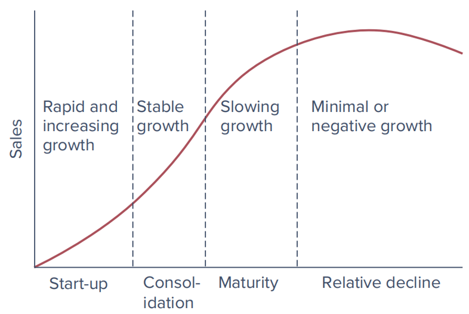

# Fundamental Analysis and Equity Valuation {#ch5}

## Fundamental Analysis Framework

### Global Economic Considerations

  - Variable performance across regions
  - Stock market returns did not always align with macroeconomic expectations
  - Political and currency risks (e.g., Brexit, exchange rate fluctuations)`[1]`

### Domestic Macroeconomy 

  - Key economic variables: GDP, employment, inflation, interest rates
  - Fiscal Policy,monetary policy and its effects (e.g., budget deficits, crowding out)
  - Consumer sentiment and drives
  
Supply shocks
  - policy changes
  - consumer sentiment
  - population change
    
Demand shocks
  - material costs
  - technology
  - natural disasters, war etc
    
**Indicators**

- Leading Indicators
  - Stock prices 
  - Manufacturer’s new orders
  - Yield curve: spread between 10-year T-bond yield and federal funds rate
- Coincident  
  - real-time retail sales
- Lagging 
  - GDP
  - unemployment rates


### Business Cycle

**Defining industry**

NAICS (North American Industry Classification System) codes

Industry classifications are never perfect

- Cyclical industries: high sensitivity to economic changes
- Defensive industries: low sensitivity 
- key consideration for time series analysis

**Factors Affecting Sensitivity**:
  - Sales sensitivity: Essentials vs. non-essentials
  - Operating leverage: Fixed versus variable costs
  - Financial leverage: Impacts on high vs. low financial leverage industries 

#### Business Growth 


### Lynch's Investing Categories

- **Slow Growers**: Large and mature companies with modest growth rates.
- **Stalwarts**: Consistent and reliable performance but usually offer moderate returns.
- **Fast Growers**: Characterized by rapid growth and high potential returns, these companies also carry higher risks.
- **Cyclicals**: Companies whose performance is tied closely to economic cycles.
- **Turnarounds**: These are companies that are currently performing poorly but have the potential for recovery.
- **Asset Plays**: Companies that possess valuable assets not currently reflected in their stock price.

**Slow growers pros and cons :**

| Pros                     | Cons                              |
|--------------------------|-----------------------------------|
| Stability and Consistency | Lower Growth Potential            |
| High Dividend Yield      | Possible Underperformance in Bull Markets |
| Lower Risk               | Limited Upside Potential           |
| Predictable Performance  | May Lack Excitement               |

### Porter (1980,1985) determinants of competition:

- Threat of Entry
- Rivalry between existing competitors 
- Pressure from substitute products
- Bargaining power of buyers
- Bargaining power of suppliers


## Equity Valuation

### Asset pricing

The present value ($P_0$) of an asset can be calculated using the formula:

$$ P_0 = \sum_{t=0}^{T} \frac{E(CF_t)}{(1+R_t)^t} $$

Where:

- $P_0$: Present value of the asset
- $E(CF_t)$: Expected cash flow at time $t$
- $R_t$: Discount rate at time $t$
- $T$: Last period for which cash flows are considered

### Valuation Ratios in Finance

  - Key ratios: PE, PB, PS
  - Importance of comparable peer firms within industry  

**P/E Ratio (Price-to-Earnings Ratio)**
  - Best for mature companies with stable earnings.
  - Compares a company's current share price to its earnings per share (EPS).
  - Indicates how much investors are willing to pay for each dollar of earnings.

**P/B Ratio (Price-to-Book Ratio)**
  - Ideal for companies with significant tangible assets, like manufacturing or real estate firms.
  - Compares a company's market price per share to its book value per share.
  - Book value is the net asset value of the company calculated as total assets minus total liabilities.

**P/S Ratio (Price-to-Sales Ratio)**
  - Suited for high-growth companies with low or negative earnings, such as start-ups or firms in industries where profitability is not immediate.
  - Compares a company's market capitalization to its total sales revenue.
  - Indicates how much investors are willing to pay per dollar of sales generated by the company.

### P/E Ratio

| Factor            | Influence on P/E Ratio                                                |
|-------------------|-----------------------------------------------------------------------|
| Industry/Sector   | Different industries have varying profitability and growth prospects. |
| Earnings Growth   | High growth typically leads to higher P/E ratios.                     |
| Risk Perception   | Higher risk can result in lower P/E ratios.                           |
| Interest Rates    | Low rates often lead to higher P/E ratios.                            |
| Market Sentiment  | Bullish sentiment can inflate P/E ratios, vice versa.                 |
| Company Size      | Larger companies may have higher P/E ratios.                          |
| Dividend Policy   | Regular dividends may lower P/E ratios.     
| Accounting Method | Different methods can affect reported earnings and hence P/E ratios.  |

### Dividend Discount Model (DDM)

The DDM estimates a stock's fair value by summing the present value of its future dividends.

If the DDM value exceeds the current stock price, it suggests the stock is undervalued; if it's lower, it may be overvalued.

The Generalized Dividend Discount Model (DDM) calculates the present value of all future dividends, incorporating the discount rate and growth rate. 

$$
\begin{align*}
V_0 &= \sum_{t=0}^{T} \frac{E(CF_t)}{(1+R_t)^t} \\
V_0 &= \frac{D_1}{1+k} + \frac{D_2}{(1+k)^2} + \ldots + \frac{D_H + P_H}{(1+k)^H}
\end{align*}
$$

In **perpetuity**, it simplifies to:

$$
\begin{align*}
V_0 &= \frac{D_1}{1+k} + \frac{D_2}{(1+k)^2} + \frac{D_3}{(1+k)^3} + \ldots \\
V_0 &= \frac{D_1}{k}
\end{align*}
$$

If dividends are growing at a constant rate $g$ forever, we have the **Constant Growth Dividend Discount Model**:

$$
\begin{align*}
V_0 &= \frac{D_0 (1+g)}{1+k} + \frac{D_0 (1+g)^2}{(1+k)^2} + \frac{D_0 (1+g)^3}{(1+k)^3} + \ldots \\
V_0 &= \frac{D_1}{k-g}
\end{align*}
$$

Where:

- $V_0$: Present value of the stock or asset.
- $E(CF_t)$: Expected cash flow at time $t$, which could represent dividends, earnings, or other cash flows.
- $R_t$: Discount rate at time $t$, often representing the required rate of return or cost of capital.
- $k$: Discount rate or required rate of return.
- $D_t$: Dividend at time $t$.
- $P_H$: Terminal value or price at the horizon year $H$.
- $g$: Growth rate of dividends.

### Constant Growth DDM

The constant-growth Dividend Discount Model (DDM) implies that the stock price is expected to grow at the same rate as dividends.

To see this:

$$
\begin{align*}
P_1 &= \frac{D_2}{k - g} 
    = \frac{D_1 (1 + g)}{k - g} 
    = \frac{D_1}{k - g} (1 + g) \\
P_1     &= P_0 (1 + g)
\end{align*}
$$

Thus, for a stock whose market value equals intrinsic value, the expected holding period return will be:

$$
\begin{align*}
E(r) &= \text{Dividend Yield} + \text{Capital Gain Yield} \\
     &= \frac{D_1}{P_0} + \frac{P_1 - P_0}{P_0} \\
E(r) &= \frac{D_1}{P_0} + g
\end{align*}
$$
Note: we can have  Various growth pattern assumptions for dividends 

### Divident stocks

| Consideration               | Description                                                                                                    |
|-----------------------------|----------------------------------------------------------------------------------------------------------------|
| Preference for High Dividends | - Some investors prefer stocks with high dividends for regular income and stability.                               |
|                              | - Dividends can be attractive in volatile markets or during low-interest-rate periods.                               |
| Dividend Trap                | - High dividend yield may signal a dividend trap if it's unsustainable due to declining earnings or cash flow.    |
|                              | - Investing in such companies could lead to capital loss if dividends are cut.                                      |
| Value Destruction            | - Companies paying high dividends without reinvesting in growth may lead to long-term value destruction.           |
|                              | - High dividends to support an overvalued stock could hinder future growth and harm shareholder value.         
|

### future earnings DDM

Rather than the earlier dividend focus, concentrates the analyst’s attention on the **core business determinants of value**

Dividends = earnings - net new investment, i.e., “$D = E - I$”.  

$$
\begin{align}
p_0 = \sum_{t=1}^{\infty} \frac{D_t}{(1+k)^t} = \sum_{t=1}^{\infty} \frac{E_t}{(1+k)^t} - \sum_{t=1}^{\infty} \frac{I_t}{(1+k)^t}
\end{align}
$$

where:

- $p_0$: Present value of the security
- $D_t$: Dividends at time $t$
- $E_t$: Earnings at time $t$
- $I_t$: Investments at time $t$
- $k$: Discount rate

### # Stock Valuation Scenarios


1. **No Growth Scenario:**
   
If all annual earnings are distributed and there is no growth
   
   $$
   P_0 = \frac{E_1}{k}
   $$

2. **Growth Opportunities Scenario:**

   If we consider the present value of growth opportunities (PVGO or NPVGO), the stock price is given by:
   
   $$
   P_0 = \frac{E_1}{k} + \text{NPVGO}
   $$

3. **Constant Growth Scenario:**

   Assuming a constant retention ratio $b$ and a constant growth rate $g$, the stock price can be expressed as:
   
   $$
   P_0 = \frac{E_1 (1 - b)}{k - g} = \frac{D_1}{k - g}
   $$

Where:
- $P_0$: Current stock price.
- $E_1$: Earnings at time 1.
- $k$: Discount rate or required rate of return.
- $\text{NPVGO}$: Net present value of growth opportunities.
- $b$: Retention ratio (portion of earnings retained in the company). $g = b*ROE$. 
- $g$: Growth rate of dividends.
- $D_1$: Dividend at time 1 (which is $E_1 (1 - b)$).


### Sources of Value Creation

Growth stock Co. initially has the same earnings of $15 as No growth Co., but reinvests 60% of its earnings each year into new investments that yield a real rate of return of 20% per year.

  $$
  \text{PV} = \frac{E_1}{k} = \frac{\$15}{0.15} = \$100
  $$

  $$
  \text{PVGO} = \frac{E_1 (1 - b)}{k - g} = \frac{\$15 (1 - 0.60)}{0.15 - 0.60 \times 0.20} = \$200
  $$

However, $g$ growth rate of dividend cannot be higher than $k$ required rate of return or equation does not work. 

```{r}
E1 <- 15              # Earnings at time 1
b <- 0.60             # Retention ratio
k <- 0.15             # Discount rate or required rate of return
ROE <- 0.20           # Return on equity
g <- b * ROE          # Sustainable growth rate

# Calculate stock price
P0 <- (E1 * (1 - b)) / (k - g)
P0

# Calculate the PVGO
P0_no_growth <- E1 / k
PVGO <- P0 - P0_no_growth
PVGO

```

### PE Ratios and Growth Scenarios

**No Growth Scenario**

In the no growth scenario, the stock price is given by:

$$
P_0 = \frac{E_1}{k} 
$$
Thus,

$$
\frac{P_0}{E_1} = \frac{1}{k}
$$

**constant growth scenario**

$$
\begin{aligned}
P_0 &= \frac{D_1}{k - g} \\
    &= \frac{E_1 (1 - b)}{k - b \cdot \text{ROE}}
\end{aligned}
$$

Thus,

$$
\begin{aligned}
\frac{P_0}{E_1} &= \frac{1 - b}{k - b \cdot \text{ROE}} \\
                &= \frac{1 - b}{k - g}
\end{aligned}
$$

Where:

- $P_0$: Current stock price.
- $E_1$: Earnings at time 1.
- $D_1$: Dividend at time 1 ($E_1 (1 - b)$).
- $k$: Discount rate or required rate of return.
- $g$: Growth rate ($b \cdot \text{ROE}$).
- $b$: Retention ratio (portion of earnings retained in the company).
- $\text{ROE}$: Return on equity.

### Pros and Cons of a High P/E Ratio

| **Pros**                                           | **Cons**                                          |
|----------------------------------------------------|---------------------------------------------------|
| Indicates strong growth expectations               | May signal overvaluation if growth expectations are unrealistic |
| Reflects investor confidence in future performance | Higher risk if the company fails to meet growth expectations  |
| Often seen in companies with innovative products or services | Can result in lower dividend yields due to reinvestment in growth |


### Free Cash Flow Models Firm FCFF

$$
FCFF = EBIT (1 - t_c) + \text{Depreciation} - \text{Capital Expenditures} - \text{Increase in NWC}
$$
$$
V_T = \frac{FCFF_{T+1}}{WACC - g}
$$

$$
\text{Firm Value} = \sum_{t=1}^{T} \frac{FCFF_t}{(1 + WACC)^t} + \frac{V_T}{(1 + WACC)^T}
$$

Where:

- $EBIT$: Earnings before interest and taxes.
- $t_c$: Corporate tax rate.
- $NWC$: Net working capital.

- $WACC$: Weighted average cost of capital.
- $V_T$: Terminal value at time $T$.

### Free Cash Flow Models Equity FCFE

$$
FCFE = FCFF - \text{Interest Expense} \cdot (1 - t_c) + \text{Increases in Net Debt}
$$

$$
E_T = \frac{FCFE_{T+1}}{k_E - g}
$$

$$
\text{Intrinsic Value of Equity} = \sum_{t=1}^{T} \frac{FCFE_t}{(1 + k_E)^t} + \frac{E_T}{(1 + k_E)^T}
$$

Where:

- $FCFF$: Free cash flow to the firm.
- $t_c$: Corporate tax rate.
- \text{Increases in Net Debt} = \text{Principal Repayments} - \text{Proceeds from Issuance of New Debt}.
- $g$: Growth rate beyond the forecast period.
- $k_E$: Cost of equity.
- $E_T$: Terminal value at time $T$.

```{R}
# Function to calculate FCFF
calculate_fcff <- function(EBIT, tax_rate, depreciation, capex, delta_nwc) {
  fcff <- EBIT * (1 - tax_rate) + depreciation - capex - delta_nwc
  return(fcff)
}

# Function to calculate FCFE
calculate_fcfe <- function(fcff, interest_expense, tax_rate, net_debt_increase) {
  fcfe <- fcff - interest_expense * (1 - tax_rate) + net_debt_increase
  return(fcfe)
}

# Example values
EBIT         <- 1000000 # Earnings before interest and taxes
tax_rate     <- 0.30    # Corporate tax rate
depreciation <- 200000  # Depreciation
capex        <- 300000  # Capital expenditures
delta_nwc    <- 50000   # Increase in net working capital

# Calculate FCFF
fcff <- calculate_fcff(EBIT, tax_rate, depreciation, capex, delta_nwc)
fcff

# Additional values for FCFE calculation
interest_expense  <- 100000 # Interest expense
net_debt_increase <- 200000 # Increase in net debt

# Calculate FCFE
fcfe <- calculate_fcfe(fcff, interest_expense, tax_rate, net_debt_increase)
fcfe

```
```{r}
# Define the cash flow components and parameters
EBIT <- c(200, 250, 300)             # Earnings before interest and taxes
tax_rate <- 0.3                      # Corporate tax rate
depreciation <- c(30, 35, 40)        # Depreciation
capex <- c(40, 50, 60)               # Capital expenditures
change_nwc <- c(-10, -5, 5)          # Change in net working capital
interest_expense <- c(20, 25, 30)    # Interest expense
increase_net_debt <- c(10, 15, 20)   # Increase in net debt
WACC <- 0.1                          # Weighted average cost of capital
k_E <- 0.12                          # Cost of equity
g <- 0.05                            # Growth rate

# Calculate FCFF for each period
FCFF <- EBIT * (1 - tax_rate) + depreciation - capex - change_nwc
FCFF
# Calculate FCFE for each period
FCFE <- FCFF - interest_expense * (1 - tax_rate) + increase_net_debt
FCFE

# Calculate Terminal Value (V_T) and Equity Terminal Value (E_T)
V_T <- FCFF[3] / (WACC - g)
E_T <- FCFE[3] / (k_E - g)

# Calculate the intrinsic value of the firm
firm_value <- sum(FCFF / (1 + WACC)^(1:3)) + V_T / (1 + WACC)^3

# Calculate the intrinsic value of equity
equity_value <- sum(FCFE / (1 + k_E)^(1:3)) + E_T / (1 + k_E)^3

# Print the results
print(paste("FCFF:", FCFF))
print(paste("FCFE:", FCFE))
print(paste("Intrinsic Value of the Firm:", firm_value))
print(paste("Intrinsic Value of Equity:", equity_value))
```

### Summary on Valuation Models:

  - Most reliable: Market value items from balance sheet (e.g., real estate, PPE)
  - Less reliable: Economic profit on existing assets
  - Least reliable: Growth opportunities