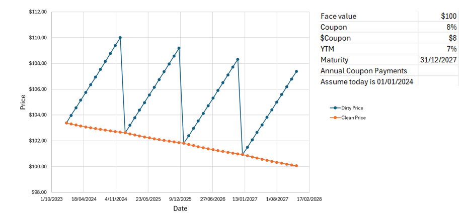
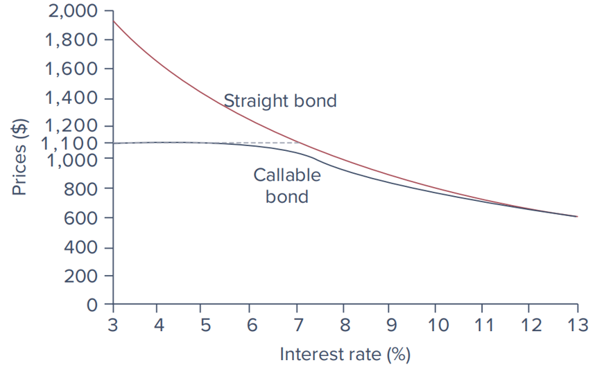
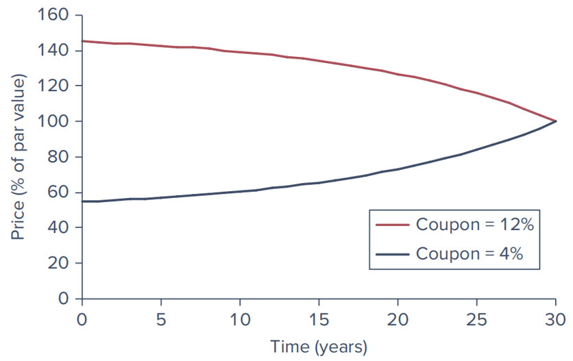

# Bond Pricing and Yields {#ch6}

## Fixed Income Securities

### characteristics of Security

- **Issuer**: The entity borrowing funds.
- **Principal**: The amount borrowed.
- **Coupon Rate**: Interest paid on the principal.
- **Maturity**: The date when the principal is repaid.

The cash flows promised to buyers represent contractual obligations of the respective issuers.
Unlike equity securities, shareholders hold "residual claims" on a firm’s assets.

### Involvement

- **Issuers**
  - Different levels of governments entity 
  - Financial intermediaries
  - Corporations

- **Investors**
  - Financial intermediaries
  - Investment funds
  - Superannuation funds
  - Corporations
  - Individuals

- **Others**
  - Credit Rating Agencies: S&P, Moody’s, Fitch
  - Regulators: ASIC, APRA, SEC

## Bond Types

| Bond Type                   | Description                                                                                       |
|-----------------------------|---------------------------------------------------------------------------------------------------|
| Fixed-Coupon Bonds          | Regular interest payments and repayment of principal at maturity.                                 |
| Indexed Bonds               | Par value and coupon payments are tied to a price index, such as CPI.                              |
| Floating Rate Bonds         | Coupon payments vary with short-term interest rates.                                              |
| Convertible Bonds           | Can be converted into a predetermined number of shares.                                           |
| Callable and Puttable Bonds | **Callable**: Issuer can repay early. <br> **Puttable**: Holder can demand early repayment.       |
| Zero-Coupon Bonds and Others| Only pay the face value at maturity. Examples include Treasury Bills.                             |
| Inflation-Protected Bonds   | Adjusted for inflation to protect investors from inflation risk. Example: Treasury Inflation-Protected Securities (TIPS). |


### Bond Prices

Between payment dates, interest accrues daily on the bond

$$
\text{Accrued Interest} = \text{Coupon} \times \left( \frac{\text{Days since last coupon payment}}{\text{Days between coupon payments}} \right)
$$



The invoice price is the fair value of the bond by taking the present value of all future cash flows (clean price (or quoted price) + accrued interest)


## Bond Yield Equations

### Current Yield
$$
Current\ Yield = \frac{Annual\ Coupon\ Payment}{Current\ Market\ Price}
$$

### Yield to Maturity (YTM)

YTM is the internal rate of return (IRR) of the bond, considering all coupon payments and the face value repayment at maturity.

It can also be interpreted as the compound rate of return over the life of the bond, assuming all coupons are reinvested at YTM

$$
P = \sum_{t=1}^{n} \frac{C}{(1+YTM)^t} + \frac{F}{(1+YTM)^n}
$$
Where:

- $P$ = Current market price
- $C$ = Annual coupon payment
- $F$ = Face value of the bond
- $n$ = Number of years to maturity

### Yield to Call (YTC)

If a bond is callable, the YTC is calculated similarly to YTM but considers the call date and call price.
$$
P = \sum_{t=1}^{t_c} \frac{C}{(1+YTC)^t} + \frac{C_p}{(1+YTC)^{t_c}}
$$
Where:

- $t_c$ = Call date
- $C_p$ = Call price



## Realized Compound Return

To find the realized compound return $r$ for investment A:

$$
1{,}000(1+r)^2 = 1{,}210
$$

Solving for $r$:

$$
r = \left(\frac{1{,}210}{1{,}000}\right)^{\frac{1}{2}} - 1 = 0.10 \quad \text{or} \quad 10\%
$$

```{r}
# Variables
initial_investment <- 1000
final_value <- 1210
n <- 2

# Calculate and print the realized compound return
r <- (final_value / initial_investment)^(1 / n) - 1
round(r * 100, 4)
```

### Yield Spread

Yield spread is the difference in yields between two different bonds, often a corporate bond and a government bond (considered risk freeish).

$$
Yield\ Spread = Yield\ of\ Corporate\ Bond - Yield\ of\ Government\ Bond
$$

### Bond Equivalent Yield (BEY)
$BEY = \frac{2 \cdot (FV - P)}{P \cdot (T)}$

Where:
- $FV$ = Face value
- $P$ = Purchase price
- $T$ = Time to maturity in years

### Effective Annual Yield (EAY)
$$EAY = \left(1 + \frac{YTM}{n}\right)^n - 1$$

Where:
- $YTM$ = Yield to maturity
- $n$ = Number of compounding periods per year

### Discount Yield

Often used for Treasury bills.
$$Discount\ Yield = \frac{(F - P)}{F} \cdot \frac{360}{Days\ to\ Maturity}$$

Where:
- $F$ = Face value
- $P$ = Purchase price
- $Days\ to\ Maturity$ = Number of days until maturity

## Bond Pricing Dynamics

### Prices Over Time



assuming the price will shift toward par. 

- **Premium Bonds**: Coupon rate exceeds YTM; price declines to par over time.

- **Discount Bonds**: YTM exceeds coupon rate; price increases to par over time.

### Holding Period Return (HPR)

$$
HPR = \frac{P_1 + (D - P_0)}{P_0}
$$
- $P_0$: Initial price
- $P_1$: Selling price
- $D$: Income received (e.g., dividends)

Includes price change and income.

Useful for comparing investment performance.
```{r}
# Variables
P_0 <- 1000     # Initial price
P_1 <- 1200      # Selling price
D <- 50         # Dividends received
n_years <- 2   # Holding period in years

# Calculate HPR
HPR <- (P_1 + D - P_0) / P0
HPR

# Annualize HPR
annualized_HPR <- (1 + HPR)^(1 / n_years) - 1
annualized_HPR
```

## Risk and Protection

### Default Risk

Evaluated by rating agencies like Moody’s, S&P, and Fitch.


### Protection Mechanisms

- **Sinking Funds**: Issuer periodically repurchases bonds to reduce default risk.
- **Subordination of Future Debt**: Restricts additional borrowing.
- **Dividend Restrictions**: Limits on dividends to protect bondholders.
- **Collateralized Bonds**: Safer than debentures.

## Credit Default Swaps (CDS)

- A CDS is a contract that transfers the credit risk of a bond to another party.
- **CDS Premium**: Depends on the probability of bankruptcy and the recovery rate.

$$
\begin{align}
CDS \ Premium &= (1 - Recovery \ Rate) \times Probability \ of \ Default
\end{align}
$$

- **Example**: A pension fund hedging default risk with a one-year CDS on a corporate bond.
