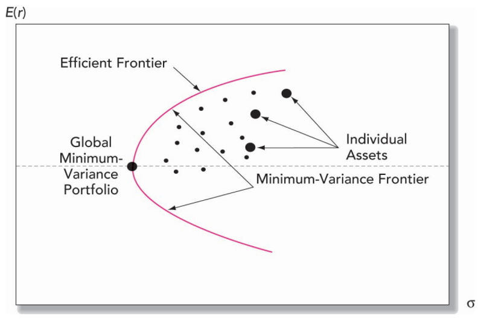
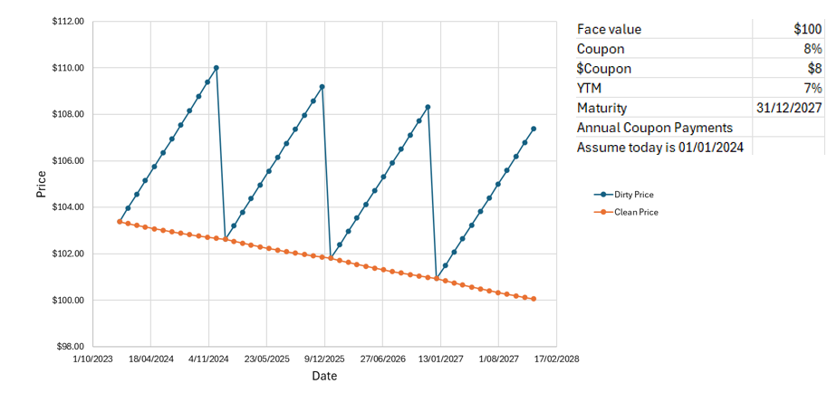

--- 
title:  "Study Note for 24Q2 AppFin704"
author: "Author: Jung Xue"
date:   "Last Updated: `r Sys.Date()`"
bibliography: references.bib
description: Study Note for 24Q2 AppFin704 
documentclass: book
link-citations: yes
site: bookdown::bookdown_site
biblio-style: apalike
---


<!--chapter:end:index.Rmd-->

# Investments and Securities Markets {#ch1}

•describe differences among asset classes and construction of stock market indexes, and calculate profit/loss on options/futures investments.

•describe how firms issue securities, and identify types of investors’ orders

•compare mechanics and implications of buying on margin & short selling

•cite pros/cons of investing with an investment company, and contrast open end mutual funds with other types of investment companies.

•define net asset value (NAV) and measure the rate of return on a mutual fund, and classify mutual funds according to investment style.

•demonstrate the impact of expenses and turnover on fund performance

## Asset Classes and Financial Instruments


### Money Markets

- Treasury bills
- Certificates of Deposits (Term Deposits)
- Commercial Paper(CP) (short term < 12month unsecured debts)
- Bankers Acceptances (a postdated check, A bank, rather than an account holder, guarantees the payment.)
- Eurodollars (U.S. dollar denominated deposits at foreign banks or foreign branches of U.S. banks)
- Repurchase Agreements (Repos or RPs) and Reverse Repos.
- Others, e.g., Brokers' Calls (interests charged by banks on loans made to brokerage firms), Federal Funds, The LIBOR Market, and Money Market Funds

### The Bond Market

- Treasury Notes/Bonds ($21 billion, $21/$51= 41% of 2020 US Bond Market)
- Mortgages and Mortgage Backed Securities ($12.7 billion, 25%
- Corporate Bonds, including secured bonds, debentures (unsecured), callable/puttable/convertible bonds ($10.6 billion, 21%
- Municipal Bonds (Issued by states/local, tax exempt)   ($3.95 billion, 7.8%)
- Federal Agency Debt, e.g., Fannie Mae, Freddie Mac ( 3.3%)
- International Bonds
  - Eurobonds: Eurodollar bonds bonds denominated in a currency other than the issuer’s currency
  - Yankee bond: US dollar denominated bond sold in the U.S. by a non U.S. issuer
- Inflation Protected Bonds (i.e., principal is adjusted per CPI)

### The Equity Market

- Common stocks
- Preferred stocks (pay preferred dividends, behaving like bond)
- Depository receipts, (shares in a foreign company)
  - ADR American Depository Receipt 
  - CRD Chinese Depository receipt
  - Reduced currency and foreign operation cost 

### Market Indexes

- Broad based index (S&P 500 etc.)
- Narrow based index (composed of only a few stocks, in a specific industry)
- Why indexes?
- Provide performance benchmarks
- Base of derivatives
- Smart beta

The goal of **Smart beta** is to obtain alpha, lower risk or increase diversification at a cost lower than traditional active management and marginally higher than straight index investing

Construction Methodology

- Price weighted (DJIA) 1 share per firm
- Market value weighted (S&P500, NASDAQ)
- Equal weighted (simple average of returns)

### Derivative Markets

- A security with a pay-off that depends on the prices of other securities
- Call/put options
- Futures/Forwards
- Swaps, futures options, etc.

Why we need them?

- Speculative
- Hedging
- Arbitraging (to lock in price)

**Arbitrage** describes the act of buying a security in one market and simultaneously selling it in another market at a higher price, thereby enabling investors to profit from the temporary difference in cost per share.

## Securities Markets and Trading

Originators

- Publicly traded companies initial public offering (IPO), and seasonal equity offerings (SEOs), - Privately held firms (private placement in which shares are sold directly to
a small group of institutional or wealthy investors)
- Shelf registrations (public firms can register securities and gradually sell them to the public )

How securities are traded (in secondary markets)

- Direct search (e.g. painting) 
- Brokered
- Dealer 
- Auctions

ype of orders
maket order
price contingeant order

Trading mechanisms
OTC dealer
electronic
market maker (increase liquidity)
--
Over the counter dealer markets (OTC Markets)
-
Electronic communication networks ( ECNs)


margin trading

why to purchase with margin?

able to make more profits by borrowing money from broker, essentially multiplying market fluctuation/volatility. 

short sale (borrow stocks to sell and payback when you sold it at profit)

derivative market (sell, not borrowing)

## Market Participants

### Investment company

- Intermediary that invest for investors
- Record and admin
- professional management
- Lower transaction cost by volume

Net Asset Value (NAV)

$$\frac{Asset - Liabilities}{share outstanding}$$
unit investement fund (unmanaged) fixed portfolio for life

Managed Investment companies 
- open-end(publicly trader and closed ended)
- close end funds shares sold at discount for liquidity (to sell quickly)

Exchange Traded Funds (ETF)

Can be continuously traded like stocks 

Other Comingled Funds, Real Estate Investment Trusts, Hedged Funds

Mutual Funds 65% of market

- Money market
- equity funds (income vs growth)
- specialised
- bond
- index funds
- Funds of Funds

Funds can be sold directly, indirectly and through financial supermarkets


Fee structure 

- Operating expense
- front end load
- back end load
- 12b-1 charges annual fee fro marketing and distribution

fee structure is very important and made large apart of your profit share

Taxation

no tax at fund level
long term capital gain tax rate
high turnover rate 

ETF
- Passive investement, track index
- lower cost
- smart beta fund

- Bid ask spread (depend on demand)
- Index price depart from NAV

mutual fund underperformed passive funds(cost of high freq trading)

consistent performance, don't be obsessed with top performer, they could be winner by chance


<!--chapter:end:01_Investments_and_Securities_Markets.Rmd-->

# Risk and Return {#ch2}

## Learning Objectives

This lecture aims to provide the ability to:

1. Compute various measures of return on multi-year investments.
2. Determine the expected return and risk of portfolios combining risky assets and risk-free investments like Treasury bills.
3. Use the **Sharpe ratio** for evaluating portfolio performance and guiding capital allocation.
4. Understand the role of utility in determining optimal capital allocation to risky assets.

## Measuring Returns

Returns can be measured in several ways:

- **Holding Period Return (HPR):** This is the return earned over the period an investment is held.
- **Returns Over Multiple Periods:** These can be compounded over time using methods such as:
  - arithmetic average, 
  - geometric average (compound annual growth rate), and 
  - dollar-weighted average (internal rate of return).
  
### Arithmetic Average

$$ \text{Arithmetic Average} = \frac{1}{N} \sum_{i=1}^{N} r_i $$
where $r_i$ is the return in period $i$ and $N$ is the total number of periods.

### Geometric Average

$$ \text{Geometric Average} = \left( \prod_{i=1}^{N} (1 + r_i) \right)^{\frac{1}{N}} - 1 $$

where $r_i$ is the return in period $i$ and $N$ is the total number of periods.

### Dollar-Weighted Average (Internal Rate of Return)
The dollar-weighted average return, or internal rate of return (IRR), is the discount rate $r$ that sets the **net present value (NPV) = 0**. It is calculated by solving the following equation:

$$ \text{Dollar-Weighted Average} = \sum_{t=0}^{N} \frac{C_t}{(1 + r)^t} = 0 $$

Where $C_t$ is the net cash flow at time $t$, and $N$ is the total number of periods.

### Annualizing Returns

- **Annual Percentage Rate (APR):** Simple annualized interest rate without compounding.
- **Effective Annual Rate (EAR):** Accounts for intra-year compounding, providing a true measure of annual return.

$$
\text{APR} = r \times n
$$

Where:

- $r$ is the periodic interest rate
- $n$ is the number of compounding periods per year

$$
\text{EAR} = \left(1 + \frac{r}{n}\right)^n - 1
$$
Where:

- $r$ is the nominal annual interest rate
- $n$ is the number of compounding periods per year

Example: 

$ 10000 Deposit, APR (annual percentage rate): 4% p.a. Compounding Quarterly.

$$ 
\begin{aligned}
EAR &= (1+r/n)^n− 1 \\
&=(1+(0.04)/4)^4 −1 \\
&=0.0406 \\
&= 4.06\% 
\end{aligned}
$$

## Risk and Risk Premiums

### Expected Return

$E(R)$ Is the weighted average of all possible returns, with weights being the probabilities of each scenario.

$$
E(R) = \sum_{i=1}^{N} p_i \cdot r_i
$$
Where:

- $E(R)$ is the expected return of the portfolio
- $p_i$ is the probability/weight of asset $i$ in the portfolio
- $r_i$ is the expected return of individual asset $i$
- $N$ is the number of assets in the portfolio

**Example Calculation**

- Asset A: weight = 50%, expected return = 10%
- Asset B: weight = 30%, expected return = 15%
- Asset C: weight = 20%, expected return = 20%

The expected return of the portfolio is:

$$
\begin{aligned}
E(R) &= (0.50 \cdot 0.10) + (0.30 \cdot 0.15) + (0.20 \cdot 0.20) \\
       &= 0.05 + 0.045 + 0.04 \\
       &= 0.135 \\
       &= 13.5\% \\  
\end{aligned}
$$
**R Code for Calculation**

```{r}
# Define the weights and expected returns of the assets
weights          <- c(0.50, 0.30, 0.20)
expected_returns <- c(0.10, 0.15, 0.20)

# Calculate the expected return of the portfolio
expected_return_portfolio <- sum(weights * expected_returns)

# Print the expected return as a percentage
expected_return_percentage <- expected_return_portfolio * 100
expected_return_percentage
```

### Standard Deviation

Measures the deviation of returns from the mean. 

$$
\sigma = \sqrt{\sum_{i=1}^{N} p(i) [r(i) - E(r)]^2}
$$

Where:

- $\sigma$ is the standard deviation of the expected return
- $p(i)$ is the probability/weight of assets $i$
- $r(i)$ is the return of individual assets $i$
- $E(r)$ is the expected return
- $N$ is the number of assets

**Example Calculation**

- asset 1: probability = 0.3, return = 0.12
- asset 2: probability = 0.4, return = 0.04
- asset 3: probability = 0.3, return = -0.02
- Expected return $E(r) = 0.046$

The standard deviation of the expected return is:

$$
\begin{aligned}
\sigma &= \sqrt{0.3(0.12 - 0.046)^2 + 0.4(0.04 - 0.046)^2 + 0.3(-0.02 - 0.046)^2}\\
       &= 0.0544\\
       &= 5.44\%
\end{aligned}
$$
**R Code for Calculation**

```{r}
# Define the probabilities and returns of the states
probabilities <- c(0.3, 0.4, 0.3)
returns <- c(0.12, 0.04, -0.02)
expected_return <- 0.046

# Calculate the variance
variance <- sum(probabilities * (returns - expected_return)^2)

# Calculate the standard deviation
standard_deviation <- sqrt(variance)

# Print the standard deviation as a percentage
standard_deviation_percentage <- standard_deviation * 100
standard_deviation_percentage

```


### Normal Distribution

Stock returns are often assumed to be normally distributed. However, real return distributions may show skewness such as "fat tails."

$$X∼N(μ,σ2)$$

$$
f(x | \mu, \sigma) = \frac{1}{\sigma \sqrt{2\pi}} \exp\left(-\frac{(x - \mu)^2}{2\sigma^2}\right)
$$

Where:

- $\mu$ is the mean
- $\sigma$ is the standard deviation
- $x$ is the variable

**standard normal distribution** is the normal distribution with mean  $μ$ = 0 and standard deviation $σ$ = 1.

$$
f(x) = \frac{1}{\sqrt{2\pi}} \exp\left(-\frac{x^2}{2}\right)
$$

Where:

- $\mu = 0$
- $\sigma = 1$
- $x$ is the variable

**Example Calculation**

Let's calculate the probability of a value $x$ in a normal distribution with a mean $\mu = 0$ and a standard deviation $\sigma = 1$ (standard normal distribution).

We will also calculate the cumulative probability (CDF) and quantiles for specific values.

**R Code for Calculation**

```{r}
# Define the parameters for the normal distribution
mu <- 0
sigma <- 1

# Define a value for x
x <- 1

# Calculate the probability density function (PDF) of the normal distribution at x
pdf_value <- dnorm(x, mean = mu, sd = sigma)

# Calculate the cumulative distribution function (CDF) of the normal distribution at x
cdf_value <- pnorm(x, mean = mu, sd = sigma)

# Calculate the quantile for a given probability
probability <- 0.95
quantile_value <- qnorm(probability, mean = mu, sd = sigma)

# Print the results
list(PDF = pdf_value, CDF = cdf_value, Quantile = quantile_value)

```

### Risk Aversion
Risk-averse investors prefer less risk for the same expected return. They demand a risk premium for taking additional risk, quantified by the price of risk (ratio of risk premium to variance).

Risk-averse investors reject investment opportunities with a **risk premium** of zero or less.

**Degree of risk aversion**

$$
A = \frac{E(r_i) - E(r_f)}{\sigma_i^2}
$$

Where:

- $A$ = degree of risk aversion 
- $E(r_i)$ is the expected return of the risky asset.
- $E(r_f)$ is the risk-free rate.
- $\sigma_i^2$ is the variance of the return of the risky asset.

**Example**

For the market portfolio (e.g., S&P 500 index funds), the average degree of risk aversion of investors is:

$$
\begin{aligned}
\bar{A} &= \frac{\text{Average}(r_M - r_f)}{\text{Sample } \sigma_M^2}\\
 &\approx \frac{0.08}{0.04} = 2
\end{aligned}
$$

Where:

- $r_M$ is the return of the market portfolio.
- $\sigma_M^2$ is the variance of the market return.

## Portfolio Construction

1. Selection of risky assets/portfolios such as stocks and bonds.

2. Decision on the proportion of the portfolio to invest in risky assets versus risk-free assets.

### Capital Allocation:

Combining investments in risk-free and risky assets allows for varying expected returns and risks.

We call the overall portfolio composed of the risk-free asset and the risky portfolio the **complete portfolio**. 

### Utility

**Utility:** Represents investor preferences, considering risk aversion. It helps in making decisions about different securities.This is a single measure we have the investor’s attitudes to risk and return at each level of wealth.

**Influence of the trade-off decisions:**

- Risk appetite (strong financial position and stable income may have higher appitite)
- proportion of the investor’s total wealth. (psychological risk aversion) 
- Financial Goals/liquidity needs (set when they need cash flow) 
- Investment Horizon (longer horizon takes more risk)
- Knowledge and Experience (Dunning Kruger effect)
- Social/Regulatory environment and incentives

### Utility Function

Captures an investor's risk-return trade-offs. Utility increases with expected return and decreases with risk. More risk-averse investors have higher coefficients of risk aversion (A).

There are countless utility functions. An example is:

$$
U = E(r) - \frac{1}{2} A \sigma^2
$$
Where:

- $U$ = the utility value, 
- $A$ = coefficient of risk aversion, 
- $\sigma^2$ = variance
- Utility increases with expected returns and decreases with risk. 
- Utility of a risk-free portfolio is equal to its rate of return. 
- More risk-averse investors will have larger values of A. 
- Investors assign higher utility to more attractive risk-return portfolios.


**Example:**

where:

- $A$  degree of risk aversion = $2$
- $r_f$ risk-free rate = $4\%$


### Indifference Curves

These curves connect portfolios providing the same utility level, illustrating an investor's preference for different risk-return combinations.

Simply above the curve Yes, below the curve no. 


### Capital Allocation Line 

It’s possible to split investment funds between safe and risky assets. 

1. Risk free asset: proxy = T-bills
2. Risky asset: stock (or a portfolio) 

- $r_f$ Risk-free rate = $7\%$
- $\sigma_{r_f}$ Standard deviation of the risk-free rate = $0$
- $E(r_p)$ Expected return of the risky portfolio = $15\%$
- $\sigma_p$ Standard deviation of the risky portfolio = $22\%$

The investor allocates $y$ proportion of their wealth in the risky portfolio and $1 - y$ in the risk-free portfolio.

$$
\begin{aligned}
E(r_c) &= (y)E(r_p) + (1 - y)r_f \\
E(r_c) &= y \times 15\% + (1 - y) \times 7\% \\
E(r_c) &= 7\% + y \times (15\% - 7\%) \\
E(r_c) &= 7\% + 8y \\
and \\
\sigma_c &= y \sigma_𝑝=22𝑦\\
\end{aligned}
$$

Example:

$$
\begin{aligned}
y        &= 0.75 \\
r_𝑐     &= 0.07+0.08*(0.75) = 13\% \\
\sigma_c &= y \sigma_𝑝=22𝑦\\
\sigma_c &= 16.5\% \\
\end{aligned}
$$


The **Sharpe Ratio**, which measures extra return per unit of risk (gradient of line), is calculated as:

$$
\begin{aligned}
\text{Sharpe ratio} &= \frac{E(r_p) - r_f}{ \sigma_p}\\
&= 8/22 \\
&= 0.36\%. 
\end{aligned}
$$

### Capital Allocation Line (CAL) with Leverage

Leverage multiplies loss and return at a cost of borrowing money from dealers. 

Borrowing at the risk-free rate extends the CAL. Borrowing rates higher than the risk-free rate cause a kink in the CAL, changing the slope.

$$
\begin{aligned}
      𝐸(r_c) &= (−0.5)∗0.09+(1.5)∗0.15\\
              &=18\% \\
	   \sigma_c &= (1.5)0.22 = 33\% \\
\text{The Sharpe ratio is} \\
	(18−9)/0.33 &= 0.27\% \\
\end{aligned}
$$


### Utility Maximization

In portfolio theory, investors aim to maximize their utility, which balances expected return and risk. Mathematically, the utility function is:

$$
\begin{aligned}
\text{Max}(U) &= E(r) - \frac{1}{2} A \sigma^2 \\
&= r_f + y [E(r_p) - r_f] - \frac{1}{2} A y^2 \sigma_p^2 \\
\text{Solve for y, we have } \\
y^* &= \frac{E(r_p) - r_f}{A \sigma_p^2}
\end{aligned}
$$

To find the optimal proportion $y^$ to invest in the risky portfolio, we solve for $y_*$:

**R code**

```{r}
# Define parameters
rf <- 0.06       # Risk-free rate
Erp <- 0.18      # Expected return of the risky portfolio
sigma_p <- 0.25  # Standard deviation of the risky portfolio
A <- 5           # Degree of risk aversion

# Calculate optimal y
y_star <- (Erp - rf) / (A * sigma_p^2)
y_star

# The Expected Return

ER = rf + (y_star*(Erp - rf))
ER
sigma_c = y_star*sigma_p
sigma_c

sharpe = (ER- rf)/sigma_c
sharpe
```
### Personal preferences 


- Investors aim to choose portfolios on higher indifference curves.
- Higher indifference curves provide a higher expected return for a given level of risk.
- More risk-averse investors have steeper indifference curves.
- More risk-averse investors require a greater increase in expected return for an increase in portfolio risk.

### The Capital Market Line (CML)

| **Aspect**                   | **Active Management**                                                | **Passive Management**                                         |
|------------------------------|----------------------------------------------------------------------|----------------------------------------------------------------|
| **Pros**                     |                                                                      |                                                                |
| Higher Return Potential      | Aims to outperform the market.                                       | Matches market returns.                                        |
| Flexibility                  | Can quickly adjust to market changes.                                | Follows index rules.                                           |
| Risk Management              | Can avoid certain sectors or stocks to manage risk.                  | Diversified holdings reduce specific risks.                    |
| Exploiting Inefficiencies    | Can capitalize on market inefficiencies.                             | Benefits from overall market growth.                           |
| Customization                | Tailors strategy to investor goals.                                  | Simple, straightforward strategy.                              |
| **Cons**                     |                                                                      |                                                                |
| Higher Costs                 | More fees and expenses due to frequent trading and research.         | Lower fees and expenses.                                       |
| Performance Uncertainty      | No guarantee of outperforming the market.                            | Predictable performance, matches index.                        |
| Increased Risk               | Higher risk from concentrated positions and market timing.           | Lower risk due to diversification.                             |
| Tax Implications             | More frequent trading can lead to higher taxes.                      | Less frequent trading, more tax efficient.                     |
| Dependence on Manager Skill  | Relies on the skill and judgment of the manager.                     | No reliance on manager skill.                                  |

<!--chapter:end:02_Risk_and_Return.Rmd-->

# Diversification {#ch3}

### Portfolio Construction

Portfolio construction generally has three steps: 

1. **Capital allocation** between the risky portfolio and risk-free assets
2. **Asset allocation** across wide asset classes (stocks, international stocks, long-term bonds). 
3. **Security selection**. 

## Major Risks of Stock Portfolio

| Risk Type        | Description                                     |
|------------------|-------------------------------------------------|
| **Market Risk**  | Fluctuations in overall market affecting portfolio value. |
| Sector Risk      | Specific sectors or industries under-performing. |
| **Company Risk** | Individual companies facing financial difficulties or poor performance. |
| Liquidity Risk   | Difficulty in buying or selling assets without significant price changes. |
| Currency Risk    | Exchange rate fluctuations impacting international investments. |
| Interest Rate Risk | Changes in interest rates affecting bond prices and portfolio value. |
| Political Risk   | Political events or policy changes impacting financial markets. |
| Regulatory Risk  | Changes in regulations affecting industries or companies in the portfolio. |

- Market risk (**systematic risk**): non-diversifiable risk
- Unique risk (**non-systematic risk**): firm-specific risk, diversifiable risk


## Portfolio Calculations

### Expected return

The **expected return** of the portfolio is

$$ E(r_P) = w_1 E(r_1) + w_2 E(r_2) $$

Where:

- $E(r_P)$is the expected return of the portfolio.
- $w_1$ is the weight of asset 1 in the portfolio.
- $E(r_1)$ is the expected return of asset 1.
- $w_2$ is the weight of asset 2 in the portfolio.
- $E(r_2)$ is the expected return of asset 2.

### variance

**Variance** measures how much the values of a random variable vary or spread out from the mean (average)

The **variance** of the portfolio $\sigma_P^2$ can be calculated using the following formula:

$$ \sigma_P^2 = w_1^2 \sigma_1^2 + w_2^2 \sigma_2^2 + 2w_1 w_2 \rho_{12} \sigma_1 \sigma_2 $$

Where:

- $\sigma_P^2$ is the variance of the portfolio.
- $w_1$ is the weight of asset 1 in the portfolio.
- $\sigma_1^2$ is the variance of returns of asset 1.
- $w_2 $ is the weight of asset 2 in the portfolio.
- $\sigma_2^2$ is the variance of returns of asset 2.
- $\rho_{12}$ is the correlation coefficient between returns of assets 1 and 2.
- $\sigma_1$ and $\sigma_2$ are the standard deviations of returns of assets 1 and 2, respectively.

The variance formula accounts for the individual variances of assets 1 and 2, as well as their **covariance**.

$$Cov(r_1,r_2 )=\rho_{12} 𝜎_1 𝜎_2$$

#### Case I: $ \rho = 1 $
When the correlation coefficient is 1, the formula simplifies to:

$$
\begin{aligned}
\sigma_P^2 &= (w_1 \sigma_1 + w_2 \sigma_2)^2 \\
\sigma_P  &= w_1 \sigma_1 + w_2 \sigma_2 \\
\end{aligned}
$$

#### Case II: $ \rho = -1 $
When the correlation coefficient is -1, the formula simplifies to:

$$
\begin{aligned}
\sigma_P^2 &= (w_1 \sigma_1 - w_2 \sigma_2)^2 \\
\sigma_P  &= w_1 \sigma_1 - w_2 \sigma_2 \\
\end{aligned}
$$

### Covariance

The **covariance** between returns of assets A and B (\(Cov(r_A, r_B)\)) can be calculated using the following formula:

$$Cov(r_A, r_B) = \sum_{i=1}^{n} p(i)[r_A(i) - E(r_A)][r_B(i) - E(r_B)]$$

Where:

- $Cov(r_A, r_B)$ is the covariance between returns of assets A and B.
- $p(i)$ is the probability of scenario $i$.
- $r_A(i)$ and $r_B(i)$ are the returns of assets A and B, respectively, in scenario $i$.
- $E(r_A)$ and $E(r_B)$ are the expected returns of assets A and B, respectively.

**R code**

```{r}
returns_A <- c(0.05, 0.03, 0.02, 0.06, 0.04)  # Returns for asset A
returns_B <- c(0.04, 0.02, 0.01, 0.05, 0.03)  # Returns for asset B

# Expected returns of assets A and B
E_r_A <- mean(returns_A)
E_r_B <- mean(returns_B)

# Probabilities of scenarios
probabilities <- c(0.2, 0.15, 0.25, 0.1, 0.3)

# Calculation of covariance
covariance <- sum(probabilities * (returns_A - E_r_A) * (returns_B - E_r_B))

# Print the covariance
print(paste("Covariance between returns of assets A and B:", covariance))

```
### Correlation 

$${\rho_12} = \frac{Cov(r_1,r_2 )}{\sigma_1 \sigma_2}$$

- The portfolio return is not affected by correlation between returns 

- Thus, investors should always prefer to add to their portfolios assets with low or negative correlation to diversify risks.

The lower the correlation, the greater the potential benefit from diversification.

### Variance calculations

If we have perfectly negatively correlated assets in our portfolios, then the portfolio standard deviation can be reduced to zero by choosing appropriate weights.


Given:

- $w_1$ = $0.40$
- $\sigma_1^2$ = $0.014$
- $w_2$ = $0.60$
- $\sigma_2^2$ = $0.04$
- $Cov(r_1, r_2)$ = $0.0072$

Calculate:
$$
\begin{aligned}
\rho        &= \frac{Cov(r_1, r_2)}{\sigma_1 \times \sigma_2} \\ 
            &= \frac{0.007}{\sqrt{0.014} \times \sqrt{0.04}} \\ 
            &= 0.3 \\
\end{aligned}
$$            
$$
\begin{aligned}           
            
 \sigma_P^2 &= w_1^2 \sigma_1^2 + w_2^2 \sigma_2^2 + 2w_1 w_2 \rho(r_1, r_2) \sigma_1 \sigma_2 \\
            &= 0.40^2 (0.014) + 0.60^2 (0.04) + 2(0.40)(0.60)[0.3\sqrt{0.014} \times \sqrt{0.04}] \\
            &= 0.02 \\
\sigma_P    &= \sqrt{0.02} = 0.142 \\
\end{aligned}
$$            
$$
\begin{aligned} 

\text{Weighted}(\sigma) &= 0.40\sqrt{0.014} + 0.60\sqrt{0.04} \\
            &= 0.168 \\
            
\end{aligned}
$$

$$
\begin{aligned} 
\text{Diversification Benefit}
            &= 0.168 - 0.142 \\
            &= 0.026 
\end{aligned}
$$
```{r}
# Given values
w1 <- 0.4
w2 <- 0.6
sigma1_squared <- 0.014
sigma2_squared <- 0.04
covariance <- 0.0072

# Calculate correlation coefficient
rho <- covariance / sqrt(sigma1_squared * sigma2_squared)
rho 

# Calculate portfolio variance
portfolio_variance <- w1^2 * sigma1_squared + w2^2 * sigma2_squared + 2 * w1 * w2 * covariance
portfolio_variance

# Calculate portfolio standard deviation
portfolio_sd <- sqrt(portfolio_variance)
portfolio_sd

# Calculate weighted standard deviation
weighted_sd <- w1 * sqrt(sigma1_squared) + w2 * sqrt(sigma2_squared)
weighted_sd

# Calculate diversification benefit
diversification_benefit <- weighted_sd - portfolio_sd
diversification_benefit

```
## Risky and Risk-Free Assets

To decide the proportion of the portfolio to be allocated between the stock and bond funds, we will introduce a risk-free asset (T-bills) to the portfolio allocation problem. 

### Sharpe Ratio

The higher a fund's Sharpe ratio (Higher Return per Unit of Risk), the better its returns have been relative to the amount of investment risk taken. 

| Sharpe Ratio Range | Classification     |
|--------------------|--------------------|
| Less than 1        | Bad                |
| 1 to 1.99          | Adequate/Good      |
| 2 to 2.99          | Very Good          |

The objective function is to maximize:

$$\frac{{E(r_1) - r_f}}{{\sigma_P}}$$

where:

$$
\begin{aligned} 
E(r_1)    &= w_1 E(r_1) + w_2 E(r_2)\\
\sigma_P  &= \sqrt{{w_1^2 \sigma_1^2 + w_2^2 \sigma_2^2 + 2w_1 w_2 Cov(r_1, r_2)}}\\
\text{subject to}:\\
w_1 + w_2 &= 1\\
\end{aligned} 
$$

To solve for $w_1$ and $w_2$, we have:

$$
w_1 = \frac{{(E(r_1) - r_f) \sigma_2^2 - (E(r_2) - r_f) Cov(r_1, r_2)}}{{(E(r_1) - r_f) \sigma_2^2 + (E(r_2) - r_f) \sigma_1^2 - (E(r_1) - r_f + E(r_2) - r_f) Cov(r_1, r_2)}}$
$w_2 = 1 - w_1$
$$

Given:

- $w_2 = 0.60$
- $w_1 = 0.40$

Thus,

$$
\begin{aligned} 
E(r_P)   &= 0.40 \times 8\% + 0.60 \times 13\% = 11\% \\
\sigma_P &= \sqrt{{0.40^2 \times 0.12^2 + 0.60^2 \times 0.20^2 + 2 \times 0.4 \times 0.6 \times (0.0072)}} \\ 
         &= 0.142 \\
\end{aligned}       
$$

$$
\begin{aligned} 
Sharpe \, ratio &= \frac{{E(r_P) - r_f}}{{\sigma_P}} \\
&= \frac{{0.11 - 0.03}}{{0.142}} \\
&= 0.42
\end{aligned} 
$$

```{r}
# Given values
w_2 <- 0.60
w_1 <- 0.40
r_f <- 0.03
E_r_1 <- 0.08
E_r_2 <- 0.13
sigma_1 <- 0.12
sigma_2 <- 0.20
Cov_r_1_r_2 <- 0.0072

# Calculate portfolio weights
w_1_calculated <- ((E_r_1 - r_f) * sigma_2^2 - (E_r_2 - r_f) * Cov_r_1_r_2) / ((E_r_1 - r_f) * sigma_2^2 + (E_r_2 - r_f) * sigma_1^2 - (E_r_1 - r_f + E_r_2 - r_f) * Cov_r_1_r_2)
w_2_calculated <- 1 - w_1_calculated
w_1_calculated
w_2_calculated
# Print results
print(paste("Calculated w_1:", w_1_calculated))
print(paste("Calculated w_2:", w_2_calculated))

# Calculate portfolio expected return
E_r_P <- w_1 * E_r_1 + w_2 * E_r_2
E_r_P
# Calculate portfolio standard deviation
sigma_P <- sqrt(w_1^2 * sigma_1^2 + w_2^2 * sigma_2^2 + 2 * w_1 * w_2 * Cov_r_1_r_2)
sigma_P
# Calculate Sharpe ratio
Sharpe_ratio <- (E_r_P - r_f) / sigma_P
Sharpe_ratio

```

### Optimal Complete Portfolio

Now that we know how to find the optimal risky portfolio, we can include the individual investor’s risk aversion (risk preferences) to find the optimal complete portfolio.

With the utility function: 

$$ U = E(r) - \frac{1}{2} A \sigma^2 $$

where $y$ is the proportion of the portfolio in the risky assets (maximizing U):

$$ y = \frac{{E(r_P) - r_f}}{{A \sigma_P^2}} $$

If $A = 4$, $E(r_P) = 0.11$, and variance = $0.142$, then:

$$
\begin{aligned}
y &= \frac{{E(r_P) - r_f}}{{A \sigma_P^2}} = \frac{{0.11 - 0.05}}{{4 \times 0.142^2}} \\ 
  &= 0.7439 \\

U &= 0.0697\\
\end{aligned}
$$

The investor will put 74.39% of funds in portfolio P and the rest (25.61%) in the risk-free asset (T-bills) 


```{r}
# Given values
A <- 4
E_r_P <- 0.11
r_f <- 0.05
variance <- 0.142

# Calculate proportion of the portfolio in risky assets (y)
y <- (E_r_P - r_f) / (A * variance^2)
y
# Calculate utility function
U <- E_r_P - 0.5 * A * variance^2
U
```

### The Efficient Frontier

The Efficient Frontier represents a set of optimal portfolios that offer the highest expected return for a given level of risk, or the lowest risk for a given level of expected return.




The analytical technique to derive efficient frontier was developed by Harry Markowitz, and is often referred to as the **Markowitz Model**

### Separation Property

Separation property states that the asset allocation problem can be divided into two independent steps: 

1. Determination of the optimal risky portfolio: this portfolio will be same for all clients. 

2. Determination of the complete portfolio that also includes the risk-free asset.

Thus, fund managers can serve many customers by only offering at least one portfolio. 

The theoretical basis of the mutual fund industry


<!--chapter:end:03_Diversification.Rmd-->

# CAPM and APT {#ch4}

- Estimate security risk premiums using capital market theory.
- Construct and use the security market line (SML).
- Specify and use a multifactor SML.
- Use Arbitrage Pricing Theory (APT) with multiple factors to identify mis-priced securities.

## The Capital Asset Pricing Model (CAPM)

The Markowitz portfolio selection model assumes all investors are rational, i.e., mean-variance optimizers.

CAPM assumes:

- Individual investors are price takers.
- All investors have a single-period planning horizon.
- No taxes or transaction costs.
- Information is costless and available to all investors.
- Investors interpret information identically.

### CAPM Equation

- The market portfolio defines the optimal Capital Allocation Line (CAL). In theory everyone tries to reach it. 

- Risk premium on the market portfolio is proportional to its risk and average risk aversion.


$$
E(R_i) = R_f + \beta_i (E(R_m) - R_f)
$$

where:

- $E(R_i)$ = expected return of investment
- $R_f$ = risk-free rate
- $\beta_i$ = beta of the investment
- $E(R_m) - R_f$ = market risk premium

Investors expect to be compensated for the risk and the time value of money.

For example, in NZ, BKMB is the risk free rate(note it is technically not) and additional basis point on top is the premium. 

$$
E(r_M) - r_f = \bar{A} \sigma_M^2
$$

$$
E(r_i) - r_f = \beta_i [E(r_M) - r_f]
$$

Here, $\bar{A}$ is the average level of risk aversion across investors (weighted average, by wealth).

and 

$$
\beta_i = \frac{\text{cov}(r_i, r_M)}{\sigma_M^2} = \frac{\rho_{i,M} \sigma_i}{\sigma_M}
$$

The CAPM calculates the expected return of an investment by adding the risk-free rate to the **beta**-adjusted market risk premium, where beta measures the investment's sensitivity to market risk and **alpha** represents the excess return not explained by beta.

### Security Market Line (SML)
- Graphs individual asset risk premiums as a function of asset risk (beta).
- Provides a benchmark for evaluating portfolio performance.

### CAPM Implementation
- Risk-free rate: Use short-term treasury securities.
- Beta: Covariance of stock and market returns divided by market variance.
- Market portfolio: Use a broad market index return.

### Violations and Limitations of the CAPM
- Empirical tests show a weaker relation between beta and returns.
- Market capitalization and book-to-market ratios predict returns better than beta.
- Other anomalies include momentum effects.

### Multifactor Models
- Allow for multiple systematic risk factors (e.g., GDP, inflation).
- Estimate a beta for each factor using multiple regression.

Example: Fama-French Three-Factor Model

- Factors: Market risk, firm size, and book-to-market ratio.

$$
E(R_i) = R_f + \beta_{iM} (E(R_M) - R_f) + \beta_{iS} (E(SMB)) + \beta_{iH} (E(HML))
$$

- $\beta_{iM}$, $\beta_{iS}$, and $\beta_{iH}$ are the betas for the market, size, and value factors.

## Comparison of CML and SML

| Feature                 | Security Market Line (SML)                                     | Capital Market Line (CML)                                     |
|-------------------------|----------------------------------------------------------------|----------------------------------------------------------------|
| **Definition**          | Relationship between expected return and beta (systematic risk)| Risk-return trade-off for efficient portfolios                |
| **Equation**            | \(E(r_i) = r_f + \beta_i (E(r_M) - r_f)\)                      | \(E(r_P) = r_f + \frac{E(r_M) - r_f}{\sigma_M} \sigma_P\)      |
| **Risk Measure**        | Beta (systematic risk)                                         | Standard deviation (total risk)                                |
| **Applicability**       | Individual securities                                          | Efficient portfolios                                           |
| **Correct Pricing**     | Securities lie on the SML                                      | Portfolios lie on the CML                                      |
| **Slope**               | Market risk premium \((E(r_M) - r_f)\)                         | Sharpe ratio of the market \(\left(\frac{E(r_M) - r_f}{\sigma_M}\right)\) |

## Arbitrage Pricing Theory (APT)

If two portfolios are mispriced, the investor could short the high-priced portfolio and buy the low-priced portfolio.

Arbitrage opportunities last for very short periods .

### Assumptions
- Returns can be described by a factor model.
- **No arbitrage opportunities.**
- Large number of securities to form diversified portfolios.

Like the CAPM, the APT also uses an SML for expected return and risk

### Key Concepts
- Systematic (factor) risk remains in diversified portfolios.
- Risk premium depends only on systematic risk.

### APT Model

**Portfolio A**
Portfolio A is a well-diversified portfolio with a beta ($\beta_P$) of 0.7. Its excess return equation is:

$$
\begin{align}
r_P - r_f &= \alpha_P + \beta_P (r_M - r_f) \\
          &= \alpha_P + 0.7(r_M - r_f)
\end{align}
$$

**Portfolio B**
Portfolio B includes the market index and T-bills with weights of 0.7 and 0.3 respectively. Its return equation is:

$$
\begin{align}
r_p &= 0.3r_f + 0.7r_M \\
    &= r_f + 0.7(r_M - r_f)
\end{align}
$$

By shorting \$1 of Portfolio A and buying \$1 of Portfolio B, you create a zero investment, zero beta portfolio. The proceeds would be riskless.

$$
\begin{align}
\text{Proceeds} &= \text{Return from Portfolio B} - \text{Return from Portfolio A} \\
                &= r_B - r_P \\
                &= \left( r_f + 0.7(r_M - r_f) \right) - \left( r_f + \alpha_P + 0.7(r_M - r_f) \right) \\
                &= -\alpha_P
\end{align}
$$

- For a well-diversified portfolio $A$:

$$
E(R_A) = R_f + \sum_{j=1}^{k} \beta_{Aj} \lambda_j
$$

- $\beta_{Aj}$ is the sensitivity of portfolio $A$ to factor $j$.
- $\lambda_j$ is the risk premium associated with factor $j$.

$$ \lambda_j= \beta_1 [E(r_{M1}) - r_f]$$

### Multifactor Generalization
- Accommodates multiple risk factors.

$$
E(R_i) = R_f + \beta_{i1} \lambda_1 + \beta_{i2} \lambda_2 + \ldots + \beta_{ik} \lambda_k
$$


### APT Pros and Cons

| **Strengths**                           | **Weaknesses**                          |
|-----------------------------------------|-----------------------------------------|
| reasonable description of risk and return   | Complex and difficult to measure        |
| Reflects various macroeconomic impacts  | world of winner chicken dinner, loser loses |
| Customizable to specific markets        | Requires extensive data                 |
| no need to measure market return directly | Dependent on accurate factor identification |

### APT v.s. CAPM

APT is more general in that it gets to an expected return and beta relationship without the assumption of the market portfolio


<!--chapter:end:04_CAPM_and_APT.Rmd-->

# Fundamental Analysis and Equity Valuation {#ch5}

## Fundamental Analysis Framework

### Global Economic Considerations

  - Variable performance across regions
  - Stock market returns did not always align with macroeconomic expectations
  - Political and currency risks (e.g., Brexit, exchange rate fluctuations)`[1]`

### Domestic Macroeconomy 

  - Key economic variables: GDP, employment, inflation, interest rates
  - Fiscal Policy,monetary policy and its effects (e.g., budget deficits, crowding out)
  - Consumer sentiment and drives
  
Supply shocks
  - policy changes
  - consumer sentiment
  - population change
    
Demand shocks
  - material costs
  - technology
  - natural disasters, war etc
    
**Indicators**

- Leading Indicators
  - Stock prices 
  - Manufacturer’s new orders
  - Yield curve: spread between 10-year T-bond yield and federal funds rate
- Coincident  
  - real-time retail sales
- Lagging 
  - GDP
  - unemployment rates


### Business Cycle

**Defining industry**

NAICS (North American Industry Classification System) codes

Industry classifications are never perfect

- Cyclical industries: high sensitivity to economic changes
- Defensive industries: low sensitivity 
- key consideration for time series analysis

**Factors Affecting Sensitivity**:
  - Sales sensitivity: Essentials vs. non-essentials
  - Operating leverage: Fixed versus variable costs
  - Financial leverage: Impacts on high vs. low financial leverage industries 

#### Business Growth 


### Lynch's Investing Categories

- **Slow Growers**: Large and mature companies with modest growth rates.
- **Stalwarts**: Consistent and reliable performance but usually offer moderate returns.
- **Fast Growers**: Characterized by rapid growth and high potential returns, these companies also carry higher risks.
- **Cyclicals**: Companies whose performance is tied closely to economic cycles.
- **Turnarounds**: These are companies that are currently performing poorly but have the potential for recovery.
- **Asset Plays**: Companies that possess valuable assets not currently reflected in their stock price.

**Slow growers pros and cons :**

| Pros                     | Cons                              |
|--------------------------|-----------------------------------|
| Stability and Consistency | Lower Growth Potential            |
| High Dividend Yield      | Possible Underperformance in Bull Markets |
| Lower Risk               | Limited Upside Potential           |
| Predictable Performance  | May Lack Excitement               |

### Porter (1980,1985) determinants of competition:

- Threat of Entry
- Rivalry between existing competitors 
- Pressure from substitute products
- Bargaining power of buyers
- Bargaining power of suppliers


## Equity Valuation

### Asset pricing

The present value ($$ P_0 $$) of an asset can be calculated using the formula:

$$ P_0 = \sum_{t=0}^{T} \frac{E(CF_t)}{(1+R_t)^t} $$

Where:

- $P_0$: Present value of the asset
- $E(CF_t)$: Expected cash flow at time $t$
- $R_t$: Discount rate at time $t$
- $T$: Last period for which cash flows are considered

### Valuation Ratios in Finance

  - Key ratios: PE, PB, PS
  - Importance of comparable peer firms within industry  

**P/E Ratio (Price-to-Earnings Ratio)**
  - Best for mature companies with stable earnings.
  - Compares a company's current share price to its earnings per share (EPS).
  - Indicates how much investors are willing to pay for each dollar of earnings.

**P/B Ratio (Price-to-Book Ratio)**
  - Ideal for companies with significant tangible assets, like manufacturing or real estate firms.
  - Compares a company's market price per share to its book value per share.
  - Book value is the net asset value of the company calculated as total assets minus total liabilities.

**P/S Ratio (Price-to-Sales Ratio)**
  - Suited for high-growth companies with low or negative earnings, such as start-ups or firms in industries where profitability is not immediate.
  - Compares a company's market capitalization to its total sales revenue.
  - Indicates how much investors are willing to pay per dollar of sales generated by the company.

### P/E Ratio

| Factor            | Influence on P/E Ratio                                                |
|-------------------|-----------------------------------------------------------------------|
| Industry/Sector   | Different industries have varying profitability and growth prospects. |
| Earnings Growth   | High growth typically leads to higher P/E ratios.                     |
| Risk Perception   | Higher risk can result in lower P/E ratios.                           |
| Interest Rates    | Low rates often lead to higher P/E ratios.                            |
| Market Sentiment  | Bullish sentiment can inflate P/E ratios, vice versa.                 |
| Company Size      | Larger companies may have higher P/E ratios.                          |
| Dividend Policy   | Regular dividends may lower P/E ratios.     
| Accounting Method | Different methods can affect reported earnings and hence P/E ratios.  |

### Dividend Discount Model (DDM)

The DDM estimates a stock's fair value by summing the present value of its future dividends.

If the DDM value exceeds the current stock price, it suggests the stock is undervalued; if it's lower, it may be overvalued.

The Generalized Dividend Discount Model (DDM) calculates the present value of all future dividends, incorporating the discount rate and growth rate. 

$$
\begin{align*}
V_0 &= \sum_{t=0}^{T} \frac{E(CF_t)}{(1+R_t)^t} \\
V_0 &= \frac{D_1}{1+k} + \frac{D_2}{(1+k)^2} + \ldots + \frac{D_H + P_H}{(1+k)^H}
\end{align*}
$$

In **perpetuity**, it simplifies to:

$$
\begin{align*}
V_0 &= \frac{D_1}{1+k} + \frac{D_2}{(1+k)^2} + \frac{D_3}{(1+k)^3} + \ldots \\
V_0 &= \frac{D_1}{k}
\end{align*}
$$

If dividends are growing at a constant rate $g$ forever, we have the **Constant Growth Dividend Discount Model**:

$$
\begin{align*}
V_0 &= \frac{D_0 (1+g)}{1+k} + \frac{D_0 (1+g)^2}{(1+k)^2} + \frac{D_0 (1+g)^3}{(1+k)^3} + \ldots \\
V_0 &= \frac{D_1}{k-g}
\end{align*}
$$

Where:

- $V_0$: Present value of the stock or asset.
- $E(CF_t)$: Expected cash flow at time $t$, which could represent dividends, earnings, or other cash flows.
- $R_t$: Discount rate at time $t$, often representing the required rate of return or cost of capital.
- $k$: Discount rate or required rate of return.
- $D_t$: Dividend at time $t$.
- $P_H$: Terminal value or price at the horizon year $H$.
- $g$: Growth rate of dividends.

### Constant Growth DDM

The constant-growth Dividend Discount Model (DDM) implies that the stock price is expected to grow at the same rate as dividends.

To see this:

$$
\begin{align*}
P_1 &= \frac{D_2}{k - g} 
    = \frac{D_1 (1 + g)}{k - g} 
    = \frac{D_1}{k - g} (1 + g) \\
P_1     &= P_0 (1 + g)
\end{align*}
$$

Thus, for a stock whose market value equals intrinsic value, the expected holding period return will be:

$$
\begin{align*}
E(r) &= \text{Dividend Yield} + \text{Capital Gain Yield} \\
     &= \frac{D_1}{P_0} + \frac{P_1 - P_0}{P_0} \\
E(r) &= \frac{D_1}{P_0} + g
\end{align*}
$$
Note: we can have  Various growth pattern assumptions for dividends 

### Divident stocks

| Consideration               | Description                                                                                                    |
|-----------------------------|----------------------------------------------------------------------------------------------------------------|
| Preference for High Dividends | - Some investors prefer stocks with high dividends for regular income and stability.                               |
|                              | - Dividends can be attractive in volatile markets or during low-interest-rate periods.                               |
| Dividend Trap                | - High dividend yield may signal a dividend trap if it's unsustainable due to declining earnings or cash flow.    |
|                              | - Investing in such companies could lead to capital loss if dividends are cut.                                      |
| Value Destruction            | - Companies paying high dividends without reinvesting in growth may lead to long-term value destruction.           |
|                              | - High dividends to support an overvalued stock could hinder future growth and harm shareholder value.         
|

### future earnings DDM

Rather than the earlier dividend focus, concentrates the analyst’s attention on the **core business determinants of value**

Dividends = earnings - net new investment, i.e., “$D = E - I$”.  

$$
\begin{align}
p_0 = \sum_{t=1}^{\infty} \frac{D_t}{(1+k)^t} = \sum_{t=1}^{\infty} \frac{E_t}{(1+k)^t} - \sum_{t=1}^{\infty} \frac{I_t}{(1+k)^t}
\end{align}
$$

where:

- $p_0$: Present value of the security
- $D_t$: Dividends at time $t$
- $E_t$: Earnings at time $t$
- $I_t$: Investments at time $t$
- $k$: Discount rate

### # Stock Valuation Scenarios


1. **No Growth Scenario:**
   
If all annual earnings are distributed and there is no growth
   
   $$
   P_0 = \frac{E_1}{k}
   $$

2. **Growth Opportunities Scenario:**

   If we consider the present value of growth opportunities (PVGO or NPVGO), the stock price is given by:
   
   $$
   P_0 = \frac{E_1}{k} + \text{NPVGO}
   $$

3. **Constant Growth Scenario:**

   Assuming a constant retention ratio $b$ and a constant growth rate $g$, the stock price can be expressed as:
   
   $$
   P_0 = \frac{E_1 (1 - b)}{k - g} = \frac{D_1}{k - g}
   $$

Where:
- $P_0$: Current stock price.
- $E_1$: Earnings at time 1.
- $k$: Discount rate or required rate of return.
- $\text{NPVGO}$: Net present value of growth opportunities.
- $b$: Retention ratio (portion of earnings retained in the company). $g = b*ROE$. 
- $g$: Growth rate of dividends.
- $D_1$: Dividend at time 1 (which is $E_1 (1 - b)$).


### Sources of Value Creation

Growth stock Co. initially has the same earnings of $15 as No growth Co., but reinvests 60% of its earnings each year into new investments that yield a real rate of return of 20% per year.

  $$
  \text{PV} = \frac{E_1}{k} = \frac{\$15}{0.15} = \$100
  $$

  $$
  \text{PVGO} = \frac{E_1 (1 - b)}{k - g} = \frac{\$15 (1 - 0.60)}{0.15 - 0.60 \times 0.20} = \$200
  $$

However, $g$ growth rate of dividend cannot be higher than $k$ required rate of return or equation does not work. 

```{r}
E1 <- 15              # Earnings at time 1
b <- 0.60             # Retention ratio
k <- 0.15             # Discount rate or required rate of return
ROE <- 0.20           # Return on equity
g <- b * ROE          # Sustainable growth rate

# Calculate stock price
P0 <- (E1 * (1 - b)) / (k - g)
P0

# Calculate the PVGO
P0_no_growth <- E1 / k
PVGO <- P0 - P0_no_growth
PVGO

```

### PE Ratios and Growth Scenarios

**No Growth Scenario**

In the no growth scenario, the stock price is given by:

$$
P_0 = \frac{E_1}{k} 
$$
Thus,

$$
\frac{P_0}{E_1} = \frac{1}{k}
$$

**constant growth scenario**

$$
\begin{aligned}
P_0 &= \frac{D_1}{k - g} \\
    &= \frac{E_1 (1 - b)}{k - b \cdot \text{ROE}}
\end{aligned}
$$

Thus,

$$
\begin{aligned}
\frac{P_0}{E_1} &= \frac{1 - b}{k - b \cdot \text{ROE}} \\
                &= \frac{1 - b}{k - g}
\end{aligned}
$$

Where:

- $P_0$: Current stock price.
- $E_1$: Earnings at time 1.
- $D_1$: Dividend at time 1 ($E_1 (1 - b)$).
- $k$: Discount rate or required rate of return.
- $g$: Growth rate ($b \cdot \text{ROE}$).
- $b$: Retention ratio (portion of earnings retained in the company).
- $\text{ROE}$: Return on equity.

### Pros and Cons of a High P/E Ratio

| **Pros**                                           | **Cons**                                          |
|----------------------------------------------------|---------------------------------------------------|
| Indicates strong growth expectations               | May signal overvaluation if growth expectations are unrealistic |
| Reflects investor confidence in future performance | Higher risk if the company fails to meet growth expectations  |
| Often seen in companies with innovative products or services | Can result in lower dividend yields due to reinvestment in growth |


### Free Cash Flow Models Firm FCFF

$$
FCFF = EBIT (1 - t_c) + \text{Depreciation} - \text{Capital Expenditures} - \text{Increase in NWC}
$$
$$
V_T = \frac{FCFF_{T+1}}{WACC - g}
$$

$$
\text{Firm Value} = \sum_{t=1}^{T} \frac{FCFF_t}{(1 + WACC)^t} + \frac{V_T}{(1 + WACC)^T}
$$

Where:

- $EBIT$: Earnings before interest and taxes.
- $t_c$: Corporate tax rate.
- $NWC$: Net working capital.

- $WACC$: Weighted average cost of capital.
- $V_T$: Terminal value at time $T$.

### Free Cash Flow Models Equity FCFE

$$
FCFE = FCFF - \text{Interest Expense} \cdot (1 - t_c) + \text{Increases in Net Debt}
$$

$$
E_T = \frac{FCFE_{T+1}}{k_E - g}
$$

$$
\text{Intrinsic Value of Equity} = \sum_{t=1}^{T} \frac{FCFE_t}{(1 + k_E)^t} + \frac{E_T}{(1 + k_E)^T}
$$

Where:

- $FCFF$: Free cash flow to the firm.
- $t_c$: Corporate tax rate.
- \text{Increases in Net Debt} = \text{Principal Repayments} - \text{Proceeds from Issuance of New Debt}.
- $g$: Growth rate beyond the forecast period.
- $k_E$: Cost of equity.
- $E_T$: Terminal value at time $T$.

```{R}
# Function to calculate FCFF
calculate_fcff <- function(EBIT, tax_rate, depreciation, capex, delta_nwc) {
  fcff <- EBIT * (1 - tax_rate) + depreciation - capex - delta_nwc
  return(fcff)
}

# Function to calculate FCFE
calculate_fcfe <- function(fcff, interest_expense, tax_rate, net_debt_increase) {
  fcfe <- fcff - interest_expense * (1 - tax_rate) + net_debt_increase
  return(fcfe)
}

# Example values
EBIT         <- 1000000 # Earnings before interest and taxes
tax_rate     <- 0.30 # Corporate tax rate
depreciation <- 200000 # Depreciation
capex        <- 300000 # Capital expenditures
delta_nwc    <- 50000 # Increase in net working capital

# Calculate FCFF
fcff <- calculate_fcff(EBIT, tax_rate, depreciation, capex, delta_nwc)
fcff

# Additional values for FCFE calculation
interest_expense  <- 100000 # Interest expense
net_debt_increase <- 200000 # Increase in net debt

# Calculate FCFE
fcfe <- calculate_fcfe(fcff, interest_expense, tax_rate, net_debt_increase)
fcfe

```

### Summary on Valuation Models:

  - Most reliable: Market value items from balance sheet (e.g., real estate, PPE)
  - Less reliable: Economic profit on existing assets
  - Least reliable: Growth opportunities

<!--chapter:end:05_Fundamental_Analysis_and_Equity_Valuation.Rmd-->

# Bond Pricing and Yields {#ch6}

## Fixed Income Securities

### characteristics of Security

- **Issuer**: The entity borrowing funds.
- **Principal**: The amount borrowed.
- **Coupon Rate**: Interest paid on the principal.
- **Maturity**: The date when the principal is repaid.

The cash flows promised to buyers represent contractual obligations of the respective issuers.
Unlike equity securities, shareholders hold "residual claims" on a firm’s assets.

### Involvement

- **Issuers**
  - Different levels of governments entity 
  - Financial intermediaries
  - Corporations

- **Investors**
  - Financial intermediaries
  - Investment funds
  - Superannuation funds
  - Corporations
  - Individuals

- **Others**
  - Credit Rating Agencies: S&P, Moody’s, Fitch
  - Regulators: ASIC, APRA, SEC

## Bond Types

| Bond Type                   | Description                                                                                       |
|-----------------------------|---------------------------------------------------------------------------------------------------|
| Fixed-Coupon Bonds          | Regular interest payments and repayment of principal at maturity.                                 |
| Indexed Bonds               | Par value and coupon payments are tied to a price index, such as CPI.                              |
| Floating Rate Bonds         | Coupon payments vary with short-term interest rates.                                              |
| Convertible Bonds           | Can be converted into a predetermined number of shares.                                           |
| Callable and Puttable Bonds | **Callable**: Issuer can repay early. <br> **Puttable**: Holder can demand early repayment.       |
| Zero-Coupon Bonds and Others| Only pay the face value at maturity. Examples include Treasury Bills.                             |
| Inflation-Protected Bonds   | Adjusted for inflation to protect investors from inflation risk. Example: Treasury Inflation-Protected Securities (TIPS). |


### Bond Prices

Between payment dates, interest accrues daily on the bond

$$
\text{Accrued Interest} = \text{Coupon} \times \left( \frac{\text{Days since last coupon payment}}{\text{Days between coupon payments}} \right)
$$



The invoice price is the fair value of the bond by taking the present value of all future cash flows (clean price (or quoted price) + accrued interest)


## Bond Yield Equations

### Current Yield
$$
Current\ Yield = \frac{Annual\ Coupon\ Payment}{Current\ Market\ Price}
$$

### Yield to Maturity (YTM)

YTM is the internal rate of return (IRR) of the bond, considering all coupon payments and the face value repayment at maturity.

It can also be interpreted as the compound rate of return over the life of the bond, assuming all coupons are reinvested at YTM

$$
P = \sum_{t=1}^{n} \frac{C}{(1+YTM)^t} + \frac{F}{(1+YTM)^n}
$$
Where:

- $P$ = Current market price
- $C$ = Annual coupon payment
- $F$ = Face value of the bond
- $n$ = Number of years to maturity

### Yield to Call (YTC)

If a bond is callable, the YTC is calculated similarly to YTM but considers the call date and call price.
$$
P = \sum_{t=1}^{t_c} \frac{C}{(1+YTC)^t} + \frac{C_p}{(1+YTC)^{t_c}}
$$
Where:

- $t_c$ = Call date
- $C_p$ = Call price


## Realized Compound Return

To find the realized compound return $r$ for investment A:

$$
1{,}000(1+r)^2 = 1{,}210
$$

Solving for $r$:

$$
r = \left(\frac{1{,}210}{1{,}000}\right)^{\frac{1}{2}} - 1 = 0.10 \quad \text{or} \quad 10\%
$$

```{r}
# Variables
initial_investment <- 1000
final_value <- 1210
n <- 2

# Calculate and print the realized compound return
r <- (final_value / initial_investment)^(1 / n) - 1
round(r * 100, 4)
```

### Yield Spread
Yield spread is the difference in yields between two different bonds, often a corporate bond and a government bond.

$$
Yield\ Spread = Yield\ of\ Corporate\ Bond - Yield\ of\ Government\ Bond
$$

### Bond Equivalent Yield (BEY)
$BEY = \frac{2 \cdot (FV - P)}{P \cdot (T)}$

Where:
- $FV$ = Face value
- $P$ = Purchase price
- $T$ = Time to maturity in years

### Effective Annual Yield (EAY)
$$EAY = \left(1 + \frac{YTM}{n}\right)^n - 1$$

Where:
- $YTM$ = Yield to maturity
- $n$ = Number of compounding periods per year

### Discount Yield

Often used for Treasury bills.
$$Discount\ Yield = \frac{(F - P)}{F} \cdot \frac{360}{Days\ to\ Maturity}$$

Where:
- $F$ = Face value
- $P$ = Purchase price
- $Days\ to\ Maturity$ = Number of days until maturity

## Bond Pricing Dynamics

### Prices Over Time


assuming the price will shift toward par. 

- **Premium Bonds**: Coupon rate exceeds YTM; price declines to par over time.

- **Discount Bonds**: YTM exceeds coupon rate; price increases to par over time.

### Holding Period Return (HPR)

$$
HPR = \frac{P_1 + (D - P_0)}{P_0}
$$
- $P_0$: Initial price
- $P_1$: Selling price
- $D$: Income received (e.g., dividends)

Includes price change and income.

Useful for comparing investment performance.
```{r}
# Variables
P0 <- 1000     # Initial price
P1 <- 1200      # Selling price
D <- 50         # Dividends received
n_years <- 2   # Holding period in years

# Calculate HPR
HPR <- (P1 + D - P0) / P0
HPR

# Annualize HPR
annualized_HPR <- (1 + HPR)^(1 / n_years) - 1
annualized_HPR
```

## Risk and Protection

### Default Risk

Evaluated by rating agencies like Moody’s, S&P, and Fitch.


### Protection Mechanisms

- **Sinking Funds**: Issuer periodically repurchases bonds to reduce default risk.
- **Subordination of Future Debt**: Restricts additional borrowing.
- **Dividend Restrictions**: Limits on dividends to protect bondholders.
- **Collateralized Bonds**: Safer than debentures.

## Credit Default Swaps (CDS)

- A CDS is a contract that transfers the credit risk of a bond to another party.
- **CDS Premium**: Depends on the probability of bankruptcy and the recovery rate.

$$
\begin{align}
CDS \ Premium &= (1 - Recovery \ Rate) \times Probability \ of \ Default
\end{align}
$$

- **Example**: A pension fund hedging default risk with a one-year CDS on a corporate bond.

<!--chapter:end:06_Bonds_and_Yields.Rmd-->

# Enter Chapter title here {#ch7}

## Summary of Lecture 7 – Fixed Income Valuation and Term Structure

### Learning Objectives
- Understand bond pricing fundamentals and the relationship between bond prices, yield to maturity, and coupon rates.
- Valuation and characteristics of zero-coupon bonds and building the yield curve.
- Valuing coupon-bearing bonds using present value of future cash flows.
- Factors affecting yield curve shape and deriving forward rates from the yield curve.

### Bond Pricing Models

#### Bond Pricing Model I
The price of a bond is the present value of expected cash flows, including coupon and principal. The discount rate is the yield to maturity ($YTM$).

$$
\begin{align}
P_b &= \sum_{t=1}^{T} \frac{C_t}{(1 + r)^t} + \frac{F}{(1 + r)^T}
\end{align}
$$


$$
\text{Annualities Factor} = \frac{1}{r} \left( 1 - \frac{1}{(1 + r)^T} \right)\
$$

$$
P_B = C_t \times \text{Annuity Factor} + \text{Par} \times \text{PV Factor}\frac{C_t}{r} \left[ 1 - \frac{1}{(1 + r)^T} \right] + \frac{\text{Par}}{(1 + r)^T}
$$

Where:

- $P_b$ = price of the bond
- $C_t$ = coupon payment
- $F$ = face value of the bond
- $T$ = number of periods
- $r$ is the appropriate discount rate, required return by bondholders, or yield to maturity 

```{r}

calculate_present_value <- function(C_t, r, T, Par) {
  annuity_factor <- (1 - 1 / (1 + r)^T) / r
  pv_factor <- 1 / (1 + r)^T
  P_B <- C_t * annuity_factor + Par * pv_factor
  return(P_B)
}

# Example usage
C_t <- 1000
r <- 0.05
T <- 10
Par <- 10000

P_B <- calculate_present_value(C_t, r, T, Par)
P_B
```

#### Bond Pricing Model II

Zero-coupon bonds involve calculating the present value of the par value, discounted by the zero-coupon rate.

$$
\begin{align}
P &= \frac{F}{(1 + z_T)^T}
\end{align}
$$

### Yield Curve
The yield curve plots yields-to-maturity for coupon bonds against their terms to maturity. It's crucial to understand forward rates, zero rates, and actual rates.

#### Forward Rate Calculation
Forward rates can be derived from zero rates to determine arbitrage-free pricing.

$$
\begin{align}
f_{n,n+1} &= \left( \frac{(1 + z_{n+1})^{n+1}}{(1 + z_n)^n} \right) - 1
\end{align}
$$

### Term Structure of Interest Rates (TSIR)
TSIR describes the relationship between interest rates and terms. The yield curve can be influenced by:

1. **Expectations Hypothesis**: Investors' expectations about future interest rates.
2. **Liquidity Preference Theory**: Prefers short-term bonds for liquidity purposes.
3. **Market Segmentation Theory**: Different investors have different preferred investment horizons.
4. **Preferred Habitat Theory**: Investors have preferred investment horizons but will deviate for adequate compensation.

### Valuation of Coupon-Bearing Bonds
To value coupon-bearing bonds, sum the present value of future cash flows (coupons and face value) discounted by the yield to maturity.

$$
\begin{align}
P &= \sum_{t=1}^{T} \frac{C}{(1 + YTM)^t} + \frac{F}{(1 + YTM)^T}
\end{align}
$$

### Immunization
Immunization strategies balance exposure to interest rate movements and reinvestment risk. Duration matching is a common immunization strategy.

$$
\begin{align}
D &= \sum_{t=1}^{T} \frac{t \cdot PV(C_t)}{P}
\end{align}
$$

Where:
- $D$ = duration
- $PV(C_t)$ = present value of coupon at time $t$

### Convexity
Convexity measures the sensitivity of the duration of a bond to changes in interest rates. Bonds with higher convexity are less affected by rate changes.

$$
\begin{align}
Convexity &= \sum_{t=1}^{T} \frac{t (t + 1) \cdot PV(C_t)}{(1 + YTM)^{t+2}}
\end{align}
$$

### Conclusion
Understanding bond pricing, valuation, and the factors affecting the yield curve is crucial for fixed-income investment. Key models include the pricing of zero-coupon and coupon-bearing bonds, the yield curve, term structure theories, and strategies for immunization and duration management.

<!--chapter:end:07_Fixed_Income_Valuation_and_Term_Structure.Rmd-->

# Performance Attribution and Appraisal {#ch8}

## Summary of Lecture 8: Performance Attribution and Appraisal

### Learning Objectives
The lecture aims to equip students with skills to:
- Compute raw and risk-adjusted rates of return.
- Evaluate investment performance.
- Apply style analysis to assess portfolio strategy.
- Decompose portfolio returns into asset allocation and security selection components.
- Assess market-timing ability.

### Steps in Performance Evaluation
1. **Performance Measurement**:
   - Calculate the return achieved by a portfolio over time.
2. **Performance Appraisal**:
   - Evaluate the overall performance of the portfolio.
3. **Performance Attribution**:
   - Determine the portion of performance due to the manager’s skill in selecting securities.

### Performance Measurement
Challenges include:
- Mismatched cash flows and measurement frequency.
- Multiple cash inflows and outflows (e.g., dividends, distributions, new funds).
- Choice of measurement methodology (Time-weighted vs. Dollar-weighted).

#### Examples
- **Example 1 & 2**: Calculating rate of return for one stock held over one period without dividends.
- **Example 3 & 4**: Calculating the rate of return in continuous time and with dividends.
- **Example 5**: Holding one stock for multiple periods without dividends, calculating arithmetic and logarithmic rates of return.
- **Example 6**: Holding one stock for multiple periods with reinvested dividends, calculating time-weighted and dollar-weighted rates of return.
- **Example 7**: Managing an open-ended fund with multiple stocks, dividends, distributions, and new fund inflows, measuring time-weighted and dollar-weighted rates of return.

### Performance Appraisal
The fundamental question is whether the portfolio's return of x% is good or bad, compared to an opportunity cost with the same risk.

#### Causes of Abnormal Performance
- Asset Allocation.
- Market Timing.
- Security Selection.
- Random influences (luck).

### Performance Appraisal Measures
1. **Simple Benchmark Index**:
   - Compare portfolio performance to a benchmark index with the same risk.
2. **Sharpe Ratio**:
   - Measures excess return per unit of total risk.
3. **Treynor Ratio**:
   - Measures excess return per unit of non-diversifiable risk.
4. **Jensen’s Alpha**:
   - Based on CAPM, measures abnormal performance.
5. **Information Ratio**:
   - Measures abnormal return per unit of risk (active return-to-risk ratio).
6. **M^2 Measure**:
   - Compares a new portfolio combining P and the risk-free asset to the market portfolio.

### Conclusion
Effective performance appraisal requires understanding and utilizing various metrics and methods to evaluate and attribute portfolio performance accurately, considering both risk and return`[1]`.

<!--chapter:end:08_Performance_Attribution_and_Appraisal.Rmd-->

# Tax Implications and ESG Investing {#ch9}

## Enter subsection 1 here

## Enter subsection 2 here

<!--chapter:end:09_Tax_Implications_and_ESG_Investing.Rmd-->

# Concluding Remarks {-}

## Three points learnt {-}

Summarise three major point that you learnt from this course:

- 
- 
- 

## Three questions to ask {-}

Come up with three questions to ponder:

- 
-
-

## Remarks {-}

-

<!--chapter:end:21_Conclusion.Rmd-->

`r if (knitr::is_html_output()) '
# References {-}
'`


<!--chapter:end:22_references.Rmd-->

# How to use RBookDown {-}

Firstly, you will have to read the [RBookDown Bible](https://bookdown.org/yihui/bookdown/) by YiHui Xie

In essence, you write in a mixture of markdown (For basics), html (to extend on markdown) and latex language (mostly for equations) to create a simple Note.

You can customise your style and theme through your own CSS. 

RMarkdown are mostly used to knit e-books(HTML), use TexStudio if you want a proper PDF, it is easier.

**Here are some useful tips to get started**

1: To add a chapter, just open a R file and save as `.RMD`. Use number 0 to 99 with a hyphen `-` to order the RMD files and maybe add a Chapter name so it is easier to select from `Files` window at bottom right of the R Studio. 

2: Code chunks can generate graphical outputs, To insert pictures just use `include_graphics` instead of `\includegraphics{}` or ``. Width can be customised. 


```
knitr::include_graphics(rep('images/knit-logo.png', 3))
```

3: Use 1 grave accent ` to include the in line code, use 3 grave accent to include a chunk of code. 


<!--chapter:end:99_Editing_Info.RMD-->

